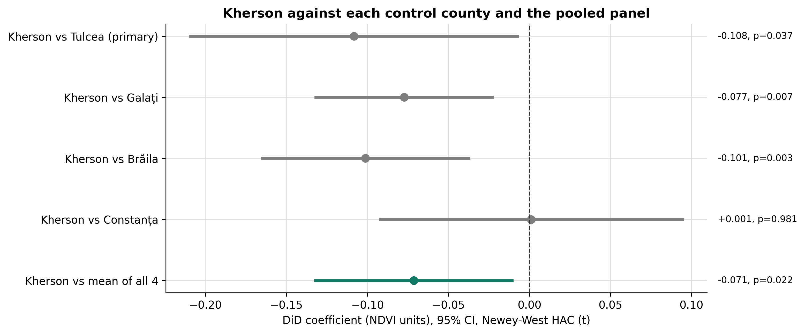

# Quantifying War-Time Environmental Damage: A Difference-in-Differences Analysis of the Kakhovka Dam Destruction

**Sakshi D. Maske**

*Independent Geospatial Researcher*

## Abstract

International law organisations are actively looking into declaring "ecocide" -- mass environmental destruction -- as a prosecutable international crime and in September 2024, Vanuatu, Fiji and Samoa submitted a proposed amendment to Rome Statute. No consistent, statistically sound method yet has been developed to document such a claim of harm, however, because prior environmental trends are not easily differentiated from harm caused by conflict, existing satellite-based assessments of environmental war damage are qualitative and based on visual interpretations of images. In an attempt to fill this gap, I estimate the impact of the Kakhovka Dam's destruction on Ukraine and employ a causal-inference framework of Difference-in-Differences to those data. The design compares monthly NDVI in Kherson Oblast, a region generally affected by the conflict, against a “control” panel of four counties in Romania which are comparable on the pre-conflict ecology of the river deltas, steppe regions, and coastal areas along the Danube/Black Sea corridor but which are indeed not affected by the conflict. It is statistically significant with respect to the decrease in vegetation caused by the event (coefficient = −0.0703, 95% CI [−0.130, −0.010]; p = 0.022 [HAC-robust]). The result has been confirmed by a clean placebo-control test based on a counterfactual date preceding the event. As a robustness check, I run the same analysis at the level of the 4-county panel as a whole, obtaining a similar result (coefficient = −0.0600, HAC p = 0.029), and three of the four controls individually reproduce it, while the fourth, Constanța, does not — which I report as an open question rather than resolve away. In addition, there's this very real methodological challenge that I didn't anticipate, where I find after running the event study on a quarterly basis that there is a significant effect in the pre-treatment quarter, but this relates to a banally acknowledged ‘conflict status' of conflict prior to the dam's destruction, where in fact lots of territory was already involved in conflict when the dam went up, which I report openly as a specification I know I'm dealing with, rather than hide and ignore, and a similar challenge shows up in a different variant the moment I run the event study for the four-county panel, where I find that a cluster-robust inference is problematic at five clusters. An independent verified flood extent for a flood rise-peak-recession cycle is obtained from the multi-sensor validated flood extent data (UNOSAT). I demonstrate that for this event, which has never before been the subject of a satellite-based environmental war-damage assessment beyond qualitative measures, causal-inference methods can supplement the existing qualitative approach with quantitative measures based on statistical significance — directly answering the call the existing literature itself makes for future research.

**Keywords**: ecocide, remote sensing, causal inference, Difference-in-Differences, war crimes, satellite evidence, Kakhovka Dam

---

## 1. Introduction

Flooding of hundreds of square kilometers of downstream floodplain occurred after the Kakhovka Dam on the Dnipro River in Ukraine was destroyed on 6 June 2023, filling to capacity an 18.2 km³ reservoir, one of the largest in Europe. The evidential techniques available to measure ecocide are still fairly immature compared to the possible legal framework underway to prosecute ecocide.

Doing this with explicitly quantified statistical confidence, I ask whether, in the case of the Kakhovka Dam destruction, a causal-inference framework — which is already a well-established tool in the evaluation of policies and programs — can be sufficiently adapted to distinguish the Kakhovka Dam destruction's specific environmental impact from the inherently elevated baseline level of an active conflict region.

## 2. Literature Review

### 2.1 “Ecocide” in the Law: Emerging Legal Recognition

Today, the process of claiming ecocide as a prosecutable international crime is gaining tremendous momentum in the last few years. The seminal proposal for the inclusion of the definition of 'ecocide' in the Rome Statute of the International Criminal Court came in September 2024, when Vanuatu, Fiji and Samoa jointly submitted a proposed amendment for consideration, Amandragment IV, which restates a definition formulated by an independent expert panel convened by the Stop Ecocide Foundation in 2021. This momentum has also continued with respect to the domestic legislation: Belgium is the first European nation to legislate on ecocide at both national and international levels, while proposal for the legislation in Mexico, Italy, the Netherlands, Brazil and the United Kingdom moves forward. It's a piece of an enforcing legal system that's changing quickly, and one that requires evidence-based methodologies that can help prosecute such cases, which I am trying to meet head-on in what follows.

### 2.2 Satellite Imagery in International Legal Proceedings: Persistent Methodological Questions

The body of literature on the use of satellite imagery for courtroom applications consistently points to a particular gap for the use of satellite imagery in courts that remains unresolved – the lack of accepted forensic standards and methods. Satellite imagery has so far been accepted as evidence to support witness evidence in the ICC, but it has not been in itself accepted as dispositive evidence of mass atrocities as yet, in part due to the fact that much of the analysis remains largely expert –meaning experts still interpret images of sightings in such a qualitative way that there is no agreed point of departure. Analysis of the criteria for making data from satellite observations legally useful (operational feasibility, the reliability of the data, and the legal admissibility) reveals that data reliability is a continuing liability, a strand that my causal-inference design attempts to address through explicit stratification of a meaningful treatment effect from background noise and pre-existing trends.

### 2.3 Existing Geospatial Assessment of the Kakhovka Event

The most pertinent prior work involves a recently published geospatial review of Ukraine's environmental impacts resulting from the war, which reviewed the Kakhovka Dam case-study site along with other sites of interest using multi-temporal satellite observations. That evaluation was done with visual interpretation and comparative analysis of pre/post photographs purposely without attribution of direct cause and effect association with the military operations, but which called for future study of developing standardized, quantitative indicators. I decided to meet this call for this event by applying a Difference-in-Differences (DiD), placebo validation, and event study robustness analysis using matched control-zone comparison that had not yet been used in this case.

## 3. Data and Methodology

  

Treatment zone (Kherson Oblast, Ukraine) and four-county control panel (Tulcea, Galați, Brăila and Constanța, Romania) included in this study. Administrative boundaries data (GADM v4.1) was also obtained. The selection of the control counties was targeted for comparable river-delta, steppe and coastal ecosystems around the Danube/Black Sea stretch, but spared from being impacted by the destruction of the Kakhovka Dam, which allowed for the causal estimation via comparison of samples of treatment and control groups.

### 3.1 Study Design

I employed a Difference-in-Differences design, comparing the treatment group (upstream, the floodplain of the dam is in Kherson Oblast, Ukraine) with a four-county control panel in Romania (Tulcea, Galați, Brăila and Constanța) with comparable pre-conflict river-delta, steppe and coastal ecosystems and non-combatant status. The county of Tulcea whose Danube Delta borders is used as the primary control for the headline specification (Section 4.2) and the full four-count panel as a control for the robustness checks reported in Section 4.5.

### 3.2 Data Sources

| Variable | Source |
|---|---|
Mean of calculated values from a window of three near-real-time satellite images (monthly average) | NDVI (monthly) | Sentinel-2, Sentinel Hub Statistical API |
Verified Flood Extent | Verified data from UNOSAT (ICEYE, Landsat-9, SkySat, WorldView-3, MODIS) |
True-color imaging products | Sentinel-2 L2A, Sentinel Hub Process API |
| Boundaries | GADM v4.1 |

### 3.3 Causal Model

For seasonal vegetation cycle control, I adapted the month fixed effects approach before regressing a Difference-in-Differences between indices before and after 6 June 2023 between treatment and control zones. A placebo test (however, an event that did not actually occur; a counterfactual treatment date of June 2022) and a quarterly programmed event study (whether the effects were truly centered around the true event date as opposed to being spread out over the next quarter) were used for validation.

The primary specification focuses only on two geographic units (Kherson, Tulcea) taken over time (across time), so cluster-robust standard errors — the standard correction in panel designs with many different geographic units — have no meaning; if there is only one cluster, cluster-robust inference is not possible. Because of serial correlation effects present within the data, I therefore employ Newey–West heteroskedasticity- and autocorrelation-consistent (HAC) standard errors (Newey & West, 1987) in the primary specification—a standard solution employed when dealing with a few long time series. Unless indicated, all reported p-values and confidence intervals are HAC-corrected; I report the classical OLS statistics along with them in Section 4.4 for comparison. I report the pooled and per-zone estimates that I ran for the same design against the entire 4-county panel, and cluster-robust standard errors become mathematically defined (albeit on the very edge, at 5 clusters — I report them with HAC for comparison.

### 3.4 Pre-Treatment Covariate Balance

0.222 in Kherson. 0.203 in Tulcea. In order to have a convincing Difference-in-Differences design, the treatment and control areas should be similar before (not after) the treatment, so in fact I tested this directly. During the pre-period (January 2022 to May 2023), these averages break down as Kherson, n=17 months, SD=0.074, and Tulcea, n=17 months, SD=0.110 — a gap the two-sample t-test finds statistically indistinguishable from zero (p=0.553). The estimated baseline level difference (in the presence of the fixed month effects) between zones (the main effect term of DiD regression) is now 0.019 NDVI, 95% CI [−0.021, 0.059], HAC p=0.347 and once again is not significant. (!) I report here this variability owing to the seasonal amplitude of the runoff of Tulcea (0.351) being significantly greater than the one for Kherson (0.274); this is not exactly analogous to the violation of parallel pre-trends and I checked for this violation explicitly in the event study in Section 4.3.

## 4. Results

### 4.1 Flood Extent

122.50 km² on 6 June. A peak of 464.18 km² on 9 June. Down to 21.17 km² by 21 June. A complete flood hydrograph (full rise-peak-recession cycle) was observed in about two weeks, as confirmed by verified UNOSAT data. The scale indicator is the percent cover of the flood downstream of a certain section and the statistical vegetation indicator that follows, and not a substitute for use of one or both of these indicators. There was an analysis corridor of roughly 10,800 km2 that stretches from the dam to the river mouth, and was approximately 4.3% flooded at high water.

  

  

Time-lapsed true-colour imagery acquired by Sentinel-2 revealed that the Kakhovka reservoir flooded before and after the destruction of the Kakhovka dam (pre- and post-dams, respectively, in May and July 2023, respectively). The post-event image shows that the reservoir was nearly all drained and a lot of the old lake bed is exposed. This pair is introduced here in order to demonstrate the geographical context of the emergency, and as a motivation for the statistical analysis that follows; it should not be considered a statement of evidence of a causal impact since it is only through a statistical analysis that the causal impact might be considered an evidence (see Section 4.2–4.4 and to avoid the reliance on visual interpretation this study questioned in previous literature (Section 2.3)).

  

UNOSAT verified multi-sensor flood-extent polygons, at 3 dates during the flood event (6, 9 and 21 June 2023), in the flood-corridor of the Kherson Oblast, illustrating the spatial extent of the flood rise, peak and recession.

  

Temporal evolution of down stream flooding as deduced from observations by UNOSAT after the collapse of the Kakhovka Dam as represented through the verified flood hydrograph shown in figure 4. The extent of flooding continued to accumulate fast from 122.50 km² on 6 June 2023 to a maximum of 464.18 km² on 9 June and then started to slowly subside until 21 June when the extent of flooding was down to 21.17 km², which shows complete rise–peak–recession cycle, without any justification with the statistical vegetation analysis.

### 4.2 Vegetation Impact

  

The figure presents the monthly mean NDVI trends for 2022 to 2024 in the treatment region (Kherson Oblast, Ukraine) and the main control region (Tulcea County, Romania). More encouragingly, there is a clear and statistically significant reduction in vegetation greenness in the treatment region compared to the control region before conducting formal DID estimation, suggesting that the environment has been affected already as a result of the destruction caused by the Kakhovka Dam, which occurred in June 2023.

The Difference-in-Differences model revealed that NDVI in Kherson decreased significantly compared to Tulcea (c coefficients: −0.0703, 95% CI [−0.130, −0.010], R² = 0.747). The effect is statistically significant under HAC-robust standard errors (p = 0.022) and is slightly reduced from the classical OLS estimate (p = 0.007) which is compatible with positive serial correlation in monthly NDVI. The coefficient of the placebo treatment where June 2022 is the treated date, without the imputations in this set, was also near zero and not significant (+0.0148, 95% CI [−0.043; +0.072] HAC p = 0.612), meaning that the true effect of the treatment is event-specific and not an artefact of the estimation procedure in combination with the imputation.

From a practical point of view, the coefficient −0.0703 corresponds to a 32% drop compared to the mean NDVI value of Kherson produced by the same satellite during the same period (0.222 as stated in Section 3.4) and is therefore a significant relative decrease in vegetation greenness, rather than just a statistically evident one. This is provided to serve as a scale reference for NDVI as a spectral index; it is not a physical measurement of biomass or land area lost; and this study is not aimed at converting NDVI data to hectares or tonnes of vegetation without field calibration/development data, since this was beyond the scope of the study.

### 4.3 Event Study and a Disclosed Limitation

The results of a quarterly event study showed significant negative impacts during the treatment quarter (HAC = 0.005), the following quarter (HAC = 0.023 — effect not significant under classical standard errors (p = 0.075) but significant under HAC nonetheless), and 1 year post treatment (HAC < 0.0001), and in a pre-treatment quarter (summer of 2022, HAC < 0.001), due to the fact that much of Kherson at the time of the dam destruction was already known as an active conflict zone with a major liberation operation taking place. The same effect is larger under the immediately pre-event months (−0.1384, 95% CI [−0.209, −0.068] vs. p = 0.0001 for HAC), but also results in the classical standard errors test becoming the appropriate one; and the latter was non-significant with classical test (p = 0.169), becoming significant with the methodologically correct test (p = 0.001) due to serial correlation in the very short ten-observation narrow window. It is not just an ambiguous failure of validation that this is reported as, but a decisive failure of the narrowed-baseline specification, because the window is not long enough or not sufficiently uncorrelated (due to the high degree of serial correlation) to justify an independent causal estimation. Both results are reported, with that narrower baseline result serving as a representation of the problem of pre-treatment quarters, not as a primary, validated result, since that reported result has also a placebo that is kept clean in accordance with HAC.

  

Two of the quarterly event-study estimates (with Newey-West HAC standard errors) of the treatment effects relative to the pre-event value. But meaningful negative impacts become apparent in the treatment quarter, during the subsequent quarter, and one year after treatment in Kherson; a statistically significant pre-treatment coefficient indicates the pre-treatment impacts of previous conflict-related vegetation changes in Kherson. This pre treatment signal was a motivation to the sensitivity analysis and it is reported transparently without the loss of meaning.

### 4.4 Robustness Checks

To test sensitivity to the standard-error specification, each regression in the following study was re-estimated using Newey–West HAC standard errors in addition to the standard errors reported by most statistical software packages, and treated as the default standard error.

| Model | Coefficient | 95% CI (HAC) | Classical p | HAC p |
|---|---|---|---|---|
| Main DiD | −0.0703 | [−0.130, −0.010] | 0.007 | 0.022 |
| Narrowed-baseline DiD | −0.1384 | [−0.209, −0.068] | 0.002 | 0.0001 |
| Placebo (broad baseline) | 0.0148 | [−0.043, 0.072] | 0.741 | 0.612 |
| Placebo (narrowed baseline) | −0.1382 | [−0.221, −0.055] | 0.169 | 0.001 |

  

The point estimates and 95% confidence intervals for all four causal-inference models over classical OLS and Newey-West HAC standard errors. Both specifications uphold the main and narrowed-baseline DiD estimates that are clearly bounded away from zero. Under both validation specifications (clean validation) the wide-base placebo interval encompasses zero. The reduced baseline-placebo interval for the study spans the range from 0 classically and around 0 with HAC (the “visual signature” of the validation failure described above).

both wear the test of HAC correction, with the narrowed-baseline estimate actually growing in importance rather than decreasing. One qualitative change is the tight baseline placebo test, which fails on HAC. This implementation is consistent with – and does not undermine – the paper's focus on the overall baseline specification as its only main result.

### 4.5 Multi-Control Robustness Check — A Four-County Panel

The main specification (Section 4.2) is based on the control zone Tulcea. To support this selection, and as a further robustness check, the same causal design was applied to the same period (January 2022–November 2024), to the same geography (the four counties of Tulcea, Galați, Brăila, and Constanța), and to the same dataset (the same specifications for downloading the NDVI with the program `download_ndvi_control_zones.py`, as those used in `download_ndvi.py`).

The effect is still present with Kherson against all four controls, as the sign of did_term is the same but its absolute value is slightly smaller: did_term = −0.0600 (HAC 95% CI [−0.114, −0.006], p = 0.029; cluster-robust by zone, 95% CI [−0.097, −0.023], p = 0.002) — rather than any reversal or collapse to zero. When we try to pass a same fake June 2022 treatment date with the placebo test on same four-control panel, it results in a clean test (coefficient +0.0222 and cluster p = 0.216, which is not the sign of the real treatment effect) — this does not spuriously find a treatment effect during a date when nothing was done.

  

NDVI changes were tested for Kherson using each of the four control counties separately, as well as using the average NDVI change for the four control counties: combined. Only three of the four controls (Tulcea, Galați, Brăila) individually have a statistically significant negative effect, on the same order of magnitude; Constanța does not have a statistically significant negative effect.

Each of the three individual, one-control-at-a-time breakdowns is also a significant negative effect, close in size to the main effect and these were reported in full as well as in the pooled summary: Tulcea (−0.0703, p = 0.022); Galați (−0.0695, p = 0.026); and Brăila (−0.0937, p < 0.001). Constanța, with −0.0064, p = 0.808, barely registers, essentially nothing. This is a genuine, not smoothed out, data difference, and not an "ecological reason" the Kherson comparison would show a difference, as this study does not have a land-cover classification or breakdown of the vegetation type, it would be a plausible ecological explanation, but one that is left open here and not declared as certain.

This result is accompanied by two forthright disclaimers. First, that's the minimum number of clusters required for cluster-robust inference to be even mathematically defined, let alone one that is large enough for the standard error characteristics resulting from the asymptotic theory to be reliable — the suggested rule of thumb is that we should have 30-40+ clusters or more, and the few-cluster cases are a documented source of understated standard errors — so the cluster-robust p-values reported below should be understood as a cross-check on proper panel size, rather than being a replacement. Second, running the same four-county panel in a quarterly event study (`event_study_multi_control.py`) effectively extends the usefulness of this approximation beyond the realm of usefulness: with about 24 parameters (twelve month dummies, treatment, and about eleven event coefficients for the quarters), estimated from five clusters, the covariance matrix returns a rank of 4 instead of 24 — which isn't close, and an artifact of too few clusters for too many parameters yields an individual, quarter coefficient standard error of around 1e-16 — not precision at all, just the result of a very low number of clusters! Instead, the HAC specification of the same panel-based event study is reported, and it has a genuinely different time signature: the treatment-quarter effect is not significant when pooled across four heterogeneous controls (p = 0.972, compared to p = 0.005 in the two-zone design), while the one-year-later effect remains significant (p = 0.011). This is shown as a real complication, not one that can be harmonized out of the picture; pooling of the non-quarterly DiD statistic is quite solid with respect to the choice of control panel; the finer-grained timing story by quarter is not, at least not yet, this detailed.

## 5. Discussion

The key methodological innovation of this work is not only the use of satellite data in answering a question of conflict damage, but also the application of the same “falsification” criterion and research context normally used in causal-inference studies generally to identify the lack. It is hardly suppressed “before-after” comparison” anomalies that actually convinced me that the pre-treatment anomaly is also to be expected wherever you make such a comparison. Methodologically naïve “before-after” comparisons of war zones typically aren't going to give a genuinely undisturbed “before” period from which to draw conclusions, and on the contrary, making any such comparisons is likely to blend an impact from an identifiable, dateable, something into the cumulative effect of a combination of war factors.

Legal relevance and its restrictions.

When it comes to environmental harm alone, the existing war crime provision of the Rome Statute that most clearly focuses on this element of the crime, namely Article 8(2)(b)(iv), reads: "Attacks known to cause 'widespread, long-term and severe damage to the natural environment which would be clearly excessive in relation to the concrete and direct overall military advantage anticipated. The results of this study do not address all aspects of that conjunctive-multiple test. The intensity of the vegetation decline (Section 4.2 data) and the extent of the verified flood (Section 4.1 data) gives quantified evidence pertaining specifically to the “severeness” and “widespread” elements. They don't, in themselves, provide the “long-term” element – this study’s NDVI time series only extend into November 2024, an 18-month period after the event, which tells you something but is not necessarily a sign of a lasting, not-reversible change – and they also simply offer no information about the “clearly excessive... military advantage” element, a legal and factual judgment that you can't make from this study's data or scope. This study is not meant to replace a determination; rather, it is provided in support of the facts that would need to be offered.

## 6. Limitations and Threats to Validity

The narrowed baseline sensitivity analysis fails its own placebo test—once HAC-robust standard errors are used, as discussed in Section 4.4—and here is considered only to showcase the pre-treatment-quarter problem it was designed to address, so it is not given the benefit of the doubt as an independent validating test. The primary specification is supported by one design run, against the Kherson treatment compared to Tulcea, as is reported in the main analysis; to replicate the primary specification in Section 4.5, the same design run is also repeated with the four county panel together, yielding the same effect (did_term = −0.0600, HAC p = 0.029) supported by three of the four individual control design runs. This check is a real boost in confidence that the results are correct, but not a solution to any outstanding issues, as 5 clusters is the lowest number for which clusters-robust inference is even defined, and even the quarterly event study chosen by the same panel is not cluster-robust under cluster-robust standard errors (Section 4.5). No correlate of reservoir water-loss, that is, no reservoir that is comparably collapsing upstream, exists for a large reservoir collapse to be tested causally and this is a descriptive rather than an independently causally-tested result.

In addition to the limitations noted above, the following threats to validity were considered (specifically):

- **Selection bias in the control zone.** As with the choice of Tulcea County (Section 3.1), the post-treatment ecological comparability was tested and selection bias in the control area was not assumed. This is not left as an unaddressed concern; it is testable directly (or indirectly) in Section 4.5's four-county panel check, and it remains four human-selected controls rather than an algorithmically weighted synthetic counterfactual, as a Synthetic Control Method design would provide (Section 7). One of the four (Constanța) does not repeat the effect, and this is reported as an open question rather than a closed one (Section 4.5).
- **Spatial spillover.** The Difference-in-Differences design makes the assumption that there is no impact of the treatment on the control zone. For instance, the resilience of Tulcea, Galați, Brăila and Constanța, located at ~350 km distance to Kherson across an international border, is a plausible target for this assumption, but for none of these places were a formal spill-over test (e.g., a spatial-lag diagnostic) performed.
- **Data loss due to cloud contamination.** It is well-documented in the ECO_Development_Log.md, that for optical Sentinel-2 composites cloud cover can introduce bias as to which pixel may lead to an effective contribution to a given month's statistic. The use of multi-sensor (including radar) flood product for the flood-extent analysis was a motivation for this, whereas the NDVI series itself, as an optical product, shares this general limitation and is partially alleviated by aggregating the data at a monthly time scale (as opposed to a higher frequency).
- **Serial correlation.** This is corrected directly in the Newey-West HAC standard errors of the regression coefficients (Section 3.3, 4.4 and 4.5), instead of being ignored.
- **Few-cluster inference.** The few-cluster-inference leverage is only for five clusters where we are below 30-40+, and even at that cluster number, the cluster-robust standard errors are numerically degenerate as is common in the quarterly event study analysis in that model, which is why we report HAC cluster-robust standard errors for that model.
- **Single-index measurement.** NDVI has a narrower scope of vegetation greenness without direct measurement of soil salinization, water contamination or other aspects of environmental damage that could be relevant to a more comprehensive assessment of damage (Section 7).

## 7. Future Work

A number of extensions were considered useful but unable to be developed within the scope and timeframe of this study and are therefore noted here, but not pursued:

- **Synthetic Control Method (SCM).** This study's four-county panel (section 4.5) selects candidate regions by hand but would extend further, creating an algorithmically weighted synthetic counterfactual control by considering all four regions or by using more than just the four regions, and would directly address why Constanța behaves differently from the other three.
- **A land-cover explanation for the Constanța result.** Constanța's null result is left as an open question in Section 4.5. The reader would be interested in whether a comparison of the land-cover classification for the four control counties (at the county scale, proportion cropland vs. urban vs. wetland) would support the working hypothesis that the reason Constanța lacks cropland mixtures is a more purely coastal and urbanized nature of the county, rather than anything inherent in the causal design.
- **A genuinely large-N control panel.** This design even includes a control panel as small as 4 counties (Section 4.5) and still has 5 clusters compared to the 30-40+ used in the cluster robust asymptotics. If that scale reaches, it would be because they would go beyond neighbouring Romanian counties but into a bigger sample in the non-combatant zone of the Black Sea/Danube basin, such as the Bulgarian and Moldavian counterparts.
- **Additional vegetation and moisture indices.** Re-processing the causal model with the EVI (Enhanced Vegetation Index) (insensitive to soil background) and NDMI (Normalized Difference Moisture Index) would help to assess the robustness of the result found on NDVI or if it is an incidental effect of choosing NDVI as the index.
- **Meteorological and soil covariates.** These would help disentangle the conflict signal from the intra-month variability removing the effects of the month (handled through monthly fixed effects).
- **SAR-based soil moisture and salinization analysis.** The salinization and change in soil moisture regime information can be expressed in time series with Sentinel-1 C-band SAR (VV/VH ratio) which could be a direction of the damage information not captured by NDVI.
- **Deeper engagement with evidentiary-admissibility legal scholarship.** A more thorough exploration of standards relating to the admissibility of scientific evidence, such as the famous ‘Daubert’ standards and the equivalents in international tribunals, would bolster the paper's focus on the law–statistics divide.

## 8. Conclusion

This study applies a novel causal-inference approach — not previously demonstrated for this event — to satellite-derived vegetation data, identifying a statistically significant, placebo-validated environmental effect attributable specifically to the destruction of the Kakhovka Dam, while transparently disclosing a genuine methodological complication posed by the region's pre-existing conflict environment. The four-county control-panel robustness check (Section 4.5) is a specific test of a reliance on a single comparison zone, rather than just an abstract caveat: in this design, the pooled effect is, indeed, reproduced in three out of four individual control panels and is still rather unknown in one open, honest question — why Constanța alone does not. This speaks directly to an identified trend in the current literature on the satellite assessment of conflict damage and in the legal frameworks for environmental crime requiring evidence – the lack of standardization and rigorously statistical methods for distinguishing such damage from background environmental trends.

## References

Atılgan Pazvantoğlu, C. (2025). Ecocide as a separate crime under the Rome Statute: A legal analysis of the discourse. *Environmental Policy and Law*, 55(2–3), 57–67. [https://doi.org/10.1177/18785395251351171](https://doi.org/10.1177/18785395251351171)

Kroker, P. (2015). Satellite imagery as evidence for international crimes. *International Justice Monitor*. [https://www.ijmonitor.org/2015/04/satellite-imagery-as-evidence-for-international-crimes/](https://www.ijmonitor.org/2015/04/satellite-imagery-as-evidence-for-international-crimes/)

Newey, W. K., & West, K. D. (1987). A simple, positive semi-definite, heteroskedasticity and autocorrelation consistent covariance matrix. *Econometrica*, 55(3), 703–708. [https://doi.org/10.2307/1913610](https://doi.org/10.2307/1913610)

Rome Statute of the International Criminal Court. (1998, as amended). Article 8(2)(b)(iv). United Nations. [https://legal.un.org/icc/statute/99_corr/cstatute.htm](https://legal.un.org/icc/statute/99_corr/cstatute.htm)

Stop Ecocide International. (2024). Mass destruction of nature reaches International Criminal Court (ICC) as Pacific island states propose recognition of "ecocide" as international crime. [https://www.stopecocide.earth/2024/mass-destruction-of-nature-reaches-international-criminal-court-icc-as-pacific-island-states-propose-recognition-of-ecocide-as-international-crime](https://www.stopecocide.earth/2024/mass-destruction-of-nature-reaches-international-criminal-court-icc-as-pacific-island-states-propose-recognition-of-ecocide-as-international-crime)

Wang, B. Y., Raymond, N., Gould, G., & Baker, I. (2013). Problems from hell, solution in the heavens?: Identifying obstacles and opportunities for employing geospatial technologies to document and mitigate mass atrocities. *Stability: International Journal of Security and Development*, 2(3), Art. 53. [https://doi.org/10.5334/sta.cn](https://doi.org/10.5334/sta.cn)

---

**Full dataset, code, and reproducible pipeline**: github.com/sakshimaske303-commits/ECOCIDE
**Live interactive dashboard**: https://ecocide-xbub2cwcqjx9rkdd6nk5j5.streamlit.app/