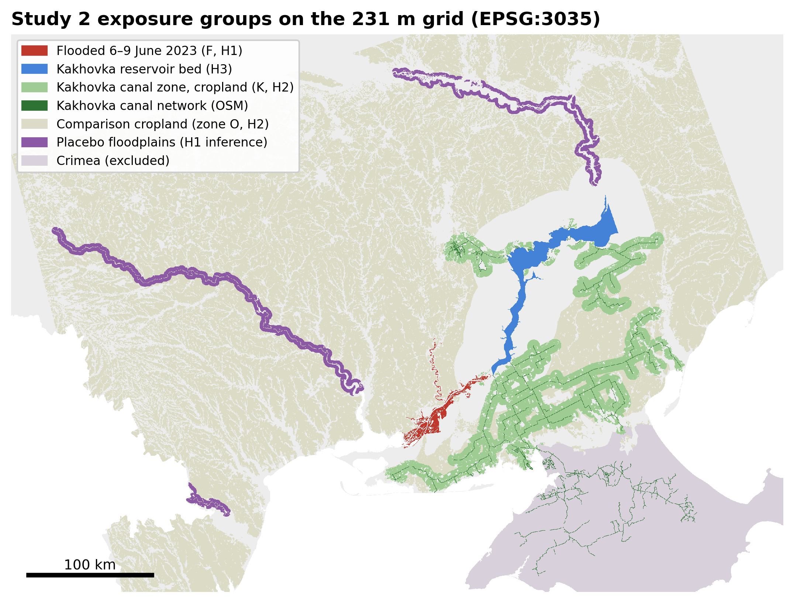
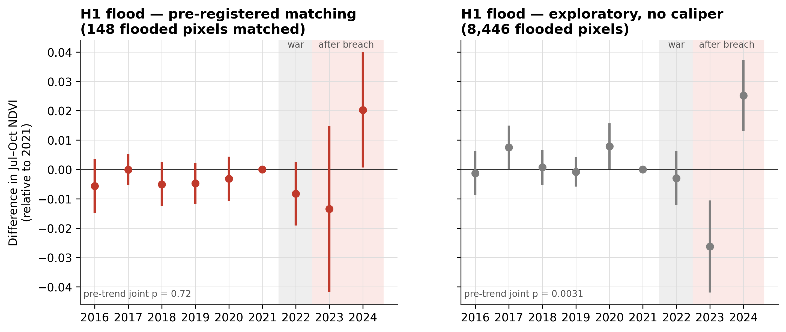
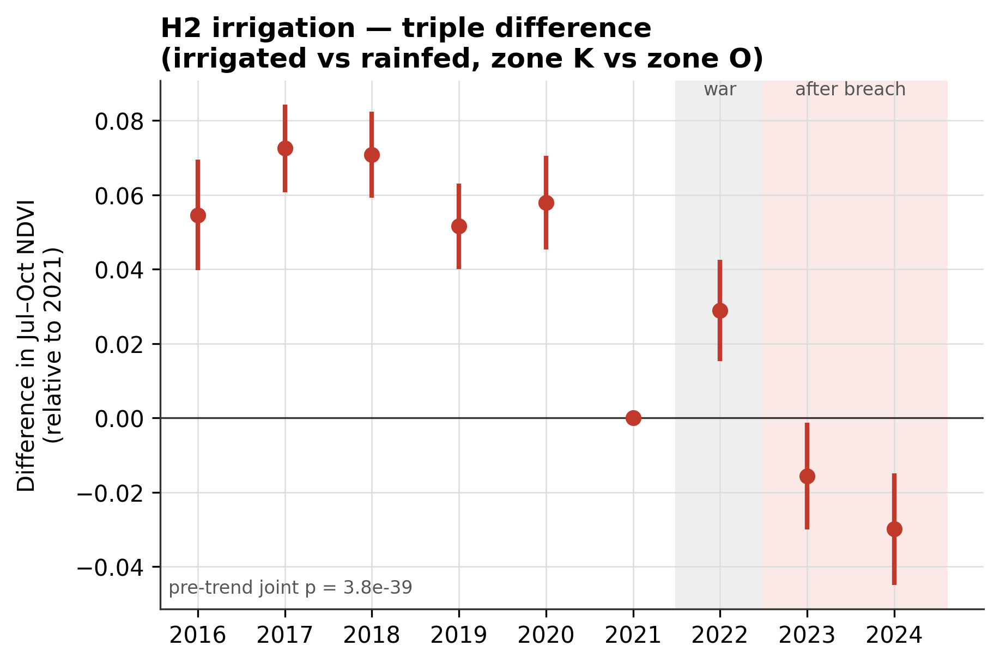
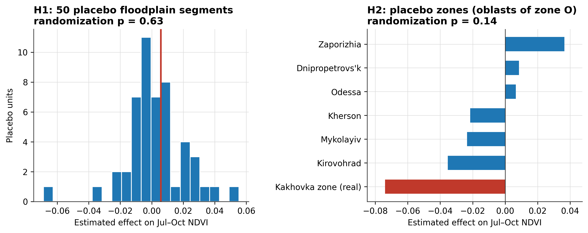
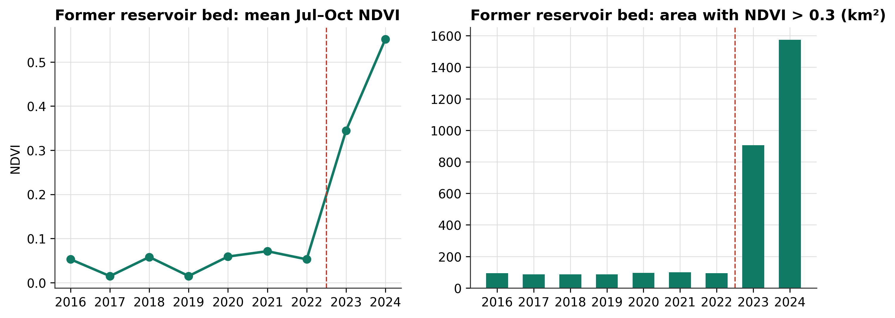
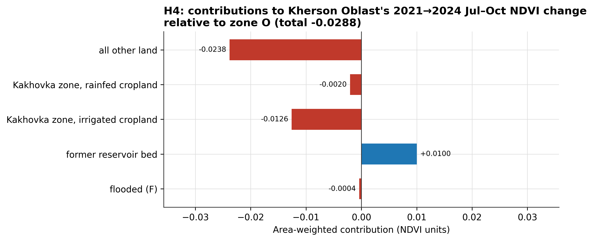
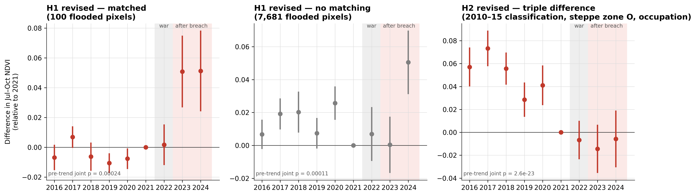

# Flood, Irrigation Loss or War? A Pre-Registered, Exposure-Based Satellite Test of the Vegetation Effects of the Kakhovka Dam Destruction

**Sakshi D. Maske**

*Independent Geospatial Researcher*

## Abstract

Satellite vegetation indices are increasingly offered as evidence of environmental damage in armed conflict, but most analyses compare administrative areas before and after an event and cannot separate the event from the war around it. We revisit the destruction of the Kakhovka Dam (6 June 2023) with a design fixed in a public analysis plan before any data were downloaded. MODIS NDVI (250 m, 2016–2024) was analysed at the pixel level, with treatment defined by exposure and comparisons made inside the war zone. We tested whether (H1) land flooded after the breach and (H2) cropland irrigated from the reservoir's canal network lost July–October greenness, relative to comparable unexposed land and to 2016–2021. We also described (H3) the drained reservoir bed and (H4) decomposed the oblast-wide change. H1 was not supported. Flooded pixels did not decline relative to matched unflooded pixels on the same river bank (+0.006 NDVI, 95% CI −0.014 to 0.026). This held across 141 placebo floodplains (randomization p = 0.63), although floodplain wetlands declined (−0.04). H2 was only suggestive. The triple-difference estimate was large (−0.074, wild-bootstrap p < 0.001), but irrigated cropland was already diverging before the war. A registered revision, committed before any further data were obtained, reclassified irrigation from 2010–2015 imagery, restricted comparisons to the steppe, and added occupation, conflict intensity and annual water masks. Under it, the canal-zone contrast did not change after the breach relative to 2021 (−0.006 to −0.014, not significant), and the canal zone was unremarkable among 15 placebo districts (p = 0.38); flooded land was, if anything, greener than matched controls (+0.055). The clearest effect was the reservoir bed. The area with NDVI above 0.3 grew from about 95 km² to 1,574 km² by 2024. Land outside every dam-exposure group accounted for most of Kherson Oblast's relative decline. Exposure-based, pre-registered designs can separate what a single aggregate signal cannot.

**Keywords**: Kakhovka Dam, armed conflict, environmental damage, NDVI, MODIS, pre-registration, difference-in-differences, randomization inference, irrigation, ecocide

---

## 1. Introduction

The Kakhovka Dam on the lower Dnipro was destroyed on 6 June 2023. Its reservoir, about 18 km³ at full capacity (Vyshnevskyi et al., 2023), drained within days, the floodplain between the dam and the Dnipro–Buh estuary was inundated, and the intake of the canal system that irrigated much of southern Ukraine's steppe was left above the water (Shumilova et al., 2025). The event is among the most cited examples of war-time environmental harm and features prominently in debates about recognising ecocide as an international crime.

Evidence that a specific act caused specific environmental damage must separate that act from everything else that changed at the same time. In southern Ukraine the "everything else" is large: the region had been a battlefield since February 2022, its agriculture was disrupted, the left bank of the Dnipro was occupied, and vegetation varies from year to year with weather. An earlier version of this study (Study 1, summarised in Section 3) compared the monthly mean NDVI of Kherson Oblast with four Romanian counties and found a statistically significant relative decline after June 2023. It could not attribute that decline to the dam. The treated unit was a whole oblast of which the flood covered 2%. Pre-event trends already diverged. The controls lay in another country, and five units cannot support a meaningful randomization test.

This paper replaces that design. Treatment is defined by exposure at 231 m resolution: flooded land, the drained reservoir bed, and cropland served by the reservoir's canal network. Exposed land is compared with unexposed land inside the same war zone. The record starts in 2016, six years before the full-scale invasion. Every analytical choice, including the decision rule used to label a hypothesis as supported, was fixed in a plan committed to the public repository before any Study 2 data were downloaded (`ANALYSIS_PLAN_v2.md`, commit 521672f). Deviations and implementation choices are listed in `v2/DEVIATIONS.md` and reported below.

The results separate mechanisms that an oblast-wide series merges. The flood itself left no persistent loss of summer greenness on the land it covered, except in floodplain wetlands. Cropland in the Kakhovka canal zone did lose greenness relative to comparable cropland elsewhere, but that contrast was already moving before the war, so its attribution to the dam is only suggestive. Within two seasons, most of the drained reservoir bed became vegetated land. Most of Kherson Oblast's relative decline came from land outside all three exposure groups.

## 2. Background

### 2.1 Legal and evidential context

Environmental damage in armed conflict is addressed in international criminal law by Article 8(2)(b)(iv) of the Rome Statute, which requires "widespread, long-term and severe damage to the natural environment" that is clearly excessive in relation to the anticipated military advantage (Rome Statute, 1998). A standalone crime of ecocide was formally proposed as an amendment in September 2024 (Stop Ecocide International, 2024). Ukraine's Criminal Code already contains one (Article 441), and Belgium adopted one in 2024 (Atılgan Pazvantoğlu, 2025). How far such a crime would apply in wartime is contested (Killean, 2025). In any form, prosecution needs evidence that links environmental change to a specific act. Satellite imagery has supported international proceedings, for example *Prosecutor v. Al Mahdi* (2016), but mostly as corroboration and without agreed standards for quantitative interpretation (Kroker, 2015; Wang et al., 2013).

### 2.2 What the dam's destruction could do to vegetation

Three pathways differ in place and timing:

1. **The flood.** It inundated about 600 km² of floodplain for days to weeks in June 2023 (UNITAR/UNOSAT, 2023). It could kill vegetation, deposit sediment and contaminants, or, once the water receded, favour regrowth.
2. **The reservoir bed.** About 2,000 km² became exposed land, where vegetation can colonise.
3. **The canals.** The reservoir fed irrigation canals serving farmland in Kherson and Zaporizhzhia oblasts and Crimea. Losing it removes the water that kept summer crops green in a dry steppe.

Superimposed on all three are the war's own effects: occupation, mining, shelling, displacement, and disrupted input and grain markets (Krampe et al., 2025). Existing assessments document these consequences with field, remote-sensing and modelling data (Shumilova et al., 2025; Vyshnevskyi et al., 2023; Leal Filho et al., 2026). To our knowledge none separates the pathways with a counterfactual design.

## 3. Study 1: why an administrative-unit design is not enough

Study 1 (previous version of this paper; all code and results retained in the repository) compared monthly Sentinel-2 NDVI of Kherson Oblast with four Romanian counties from January 2022 to November 2024. Kherson declined relative to its primary control by 0.108 NDVI (95% CI 0.007 to 0.209; p = 0.037), or 0.069 with zone-specific seasonality (p = 0.005), and a June 2022 placebo date showed no effect. Three checks undermined attribution:

- In a randomization test across the five units Kherson ranked second (p = 0.40).
- Four of five pre-event quarters already deviated from the reference quarter.
- The estimate changed across three versions of the data extraction.

The flood covered about 2% of the oblast. Even a total loss of vegetation on every flooded pixel would have moved the oblast mean by about 0.02, a fraction of the estimated decline. Study 1 therefore showed a real relative decline without showing what caused it. Its ten design limitations (plan §1) motivated every element of Study 2.

## 4. Data and Methods

### 4.1 Pre-registration

The analysis plan (`ANALYSIS_PLAN_v2.md`, version 1.0) was committed to the public GitHub repository at 15:33 IST on 24 September 2026 (commit 521672f), before the first Study 2 data file was downloaded (the first MODIS composite was written about 20 minutes later). The plan has not been changed since. It fixes:

- the hypotheses
- the exposure definitions
- outcomes and periods
- the estimating equations
- the inference procedures
- nine robustness checks
- the decision rule that maps results to the words *supported*, *suggestive* and *not supported*

Three deviations and eleven implementation choices were logged during analysis (`v2/DEVIATIONS.md`; Section 4.8). Analyses not in the plan are labelled exploratory.

### 4.2 Data and grid

All data were placed on one equal-area grid: EPSG:3035, 231.656 m pixels (the MODIS 250 m product's true pixel size), covering 29.0–36.5 °E and 45.3–49.3 °N. The grid spans the lower Dnipro, the former reservoir, the Dnipro reservoirs upstream, the Southern Buh and the lower Dniester.

| Dataset | Use | Source |
|---|---|---|
| MODIS Terra MOD13Q1 v061, 16-day, 250 m, 2016–2024 (NDVI, EVI, pixel reliability, composite day-of-year) | outcomes | Didan (2021), via Microsoft Planetary Computer |
| ESA WorldCover 2021 v200, 10 m | land-cover fractions per pixel | Zanaga et al. (2022) |
| UNOSAT FL20230606UKR | flood exposure; pre-breach water extent | UNITAR/UNOSAT (2023) |
| ERA5-Land monthly means, 2015–2024 | July–October precipitation and temperature | Muñoz-Sabater et al. (2021) |
| OpenStreetMap `waterway=canal` | irrigation network | OpenStreetMap contributors (2026) |
| GADM v4.1 | country and oblast boundaries | GADM (2022) |

The Planetary Computer catalogue contained 204 of the 207 expected MODIS composites. One of the three missing composites (12 August 2024) falls in the outcome window.

**Pixel universe.** Pixels inside Ukraine, excluding Crimea and Sevastopol, with at least 90% valid WorldCover coverage: 3.49 million pixels.

### 4.3 Outcomes

**Primary outcome.** The mean July–October NDVI of each pixel in each year. Only observations with MODIS pixel reliability 0 (good) or 1 (marginal) are used, and each observation is assigned to the season by its own composite day-of-year. A pixel-year is missing if fewer than five valid observations remain. The July–October window keeps 2023 entirely after the breach.

**Secondary outcomes.**

- July–August mean NDVI
- April–October mean NDVI, excluding 2023
- July–October mean EVI
- for cropland, a "cropped" indicator: 90th-percentile April–October NDVI ≥ 0.5

**Periods.** 2016–2021 are pre-war, 2022 is the war year before the breach, and 2023–2024 are post-breach.

**Fixed panel.** A pixel enters an analysis only if it has the outcome in at least seven of the nine years.

### 4.4 Exposure groups (Figure 1)

**Flooded (F; H1).**

- Definition: at least 50% of the pixel inside UNOSAT's cumulative 6–9 June 2023 flood polygon, and less than 20% permanent water. This gives 9,247 pixels, or 500 km².
- Excluded: pixels 10–50% flooded, and pixels flooded only in other June layers.
- Candidate controls: pixels 0% flooded in all 13 June 2023 UNOSAT flood layers, 2–15 km from a flooded pixel, less than 20% water, and on the same bank.

**River banks.** The Dnipro main channel was traced as the least-cost path through pre-breach water, from the Zaporizhzhia dam to the estuary mouth. Land within 30 km of the flood was split along it into right bank (unoccupied after November 2022) and left bank (occupied). Of the flooded pixels, 2,765 lie on the right bank and 6,482 on the left.

**Matching.** Within each bank × dominant-land-cover stratum, each flooded pixel was matched to three controls (with replacement). Matching used the Mahalanobis distance on the six 2016–2021 values of the outcome, with a caliper of 0.25 SD of the treated–control distance distribution.

**Former reservoir bed (H3).** The largest connected body of at least 50% WorldCover water between the Kakhovka and Zaporizhzhia dams: 1,812 km² on the grid.

**Kakhovka canal zone (K) and comparison zone (O; H2).**

- Network: OpenStreetMap canals within 2 km of the reservoir or of the Dnipro within 5 km below the dam, plus every canal connected to them. This gives 1,879 canal segments totalling 3,264 km.
- Zone K: cropland (WorldCover crop ≥ 60%) within 5 km of that network.
- Zone O: cropland more than 30 km from the reservoir and more than 5 km from the network.
- Irrigated before the war: mean July–August NDVI ≥ 0.45 in at least three of 2017–2021.
- Rainfed: mean July–August NDVI < 0.35 in at least four of those years.
- Other cropland is excluded.
- Resulting groups: 97,344 irrigated and 22,926 rainfed pixels in K; 1,362,498 irrigated and 106,863 rainfed pixels in O.

**Placebo units.**

- H1: floodplains within 3 km of permanent river water along the Southern Buh (407 km of river), the lower Dniester (116 km) and the Dnipro above Zaporizhzhia (232 km). These were cut into 10 km segments per river side, giving 141 units. Each was treated as if flooded and put through the H1 pipeline.
- H2: each oblast of zone O in turn was treated as if it were zone K.

### 4.5 Estimation

**H1 (matched flood design).**

Yiy = αi + λy,s + β·Fi·Posty + δ·Fi·Wary + γ′Wiy + εiy

where:

- αi: pixel fixed effects
- λy,s: year × stratum (bank × dominant class) effects
- W: July–October ERA5-Land precipitation and temperature of the pixel's 0.1° cell
- Matched controls are weighted by Σ1/k over the flooded pixels they serve.

**H2 (triple difference).**

Yiy = αi + λy,oblast + μy,irrigated + κy,zone + β·Irri·Ki·Posty + δ·Irri·Ki·Wary + γ′Wiy + εiy

In both models β is the primary estimand and δ separates the war year. The event-study versions replace the Post and War terms with year dummies, with 2021 as reference. Fixed effects were removed by an exact projection: within-pixel demeaning, then partialling out the low-dimensional effects (Frisch–Waugh–Lovell). Each estimate was checked against an explicit dummy-variable regression on a subsample.

### 4.6 Inference

- Standard errors are clustered on 10 km × 10 km blocks.
- Wild cluster bootstrap p-values: restricted, Rademacher weights, 9,999 draws (Cameron et al., 2008).
- Conley (1999) spatial standard errors with a 25 km Bartlett kernel.
- Randomization p-values from the placebo units: the share of placebo estimates at least as negative as the real one.
- The two primary hypotheses are corrected for multiplicity with the Holm (1979) procedure.
- Pre-trends: a joint F-test that the 2016–2020 event-study coefficients are zero.
- Sensitivity to parallel-trends violations uses the relative-magnitudes restriction of Rambachan and Roth (2023). The post-breach violation may change per year by at most M̄ times the largest pre-period year-to-year change, for M̄ = 0.5, 1 and 2. The target is the average 2023–2024 effect relative to 2021.

### 4.7 Decision rule (fixed in advance)

- **Supported:** β < 0, Holm-adjusted wild-bootstrap p < 0.05, randomization p < 0.10, and the M̄ = 1 robust interval excludes zero.
- **Suggestive:** β < 0 with unadjusted p < 0.05 but one of the other conditions fails.
- **Not supported:** otherwise.

### 4.8 Deviations

Three deviations from the plan are logged in `v2/DEVIATIONS.md`:

1. **Conley kernel.** The plan did not name one. A flat kernel gave a near-zero variance in the small H1 matched sample, so a Bartlett kernel was used.
2. **H2 placebo zones.** Five oblasts of zone O have almost no rainfed cropland and cannot form a placebo. The six that remain make the minimum attainable randomization p equal to 1/7 = 0.14. H2 could therefore not reach "supported" by construction, a fact we discovered only when running the analysis.
3. **H1 placebo units.** Formed per river side. Those with fewer than ten matched pixels are dropped from the matched test (50 of 141 remain).

The caliper wording in the plan was ambiguous. Our reading was coded before results were seen, and its consequences are reported in Section 5.1.

### 4.9 Registered revision

The pre-registered analyses exposed five problems:

1. H2 irrigation status came from the same years as the outcome's pre-period.
2. The irrigation rule labelled rainfed summer crops as irrigated outside the dry south.
3. The H2 placebo test had a floor of p = 0.14.
4. Neither model accounted for war intensity or occupation.
5. The water share of each pixel was fixed at 2021, although river levels changed after the breach.

A registered revision (`ANALYSIS_PLAN_v2_ADDENDUM_1.md`) was committed at 22:53 IST on 24 September 2026 (commit 30e3840). This was after the pre-registered results were known, but before the additional data it needed were downloaded and before any revised analysis was run. It specifies:

- **R1:** irrigated and rainfed status from July–August NDVI 2010–2015 (irrigated: ≥ 0.45 in ≥ 4 of 6 years; rainfed: < 0.35 in ≥ 5 of 6).
- **R2:** comparison zone restricted to the four steppe oblasts (Odesa, Mykolaiv, Kherson, Zaporizhzhia), with Dnipropetrovsk added as a sensitivity check.
- **R3:** placebo units at district (raion) level: districts with at least 300 irrigated and 300 rainfed pixels.
- **R4:** occupation and conflict intensity from VIINA (Zhukov, 2023).
  - Occupation: each pixel takes the 1 August control status of the nearest settlement within 10 km.
  - Conflict intensity: log(1 + war-related events located at settlement level within 5 km, 1 March–31 October).
  - Added to H1: year × 2 km distance-to-channel fixed effects and the conflict term.
  - Added to H2: year × irrigated × occupied fixed effects and the conflict term.
- **R5:** annual water share from Impact Observatory 10 m land cover, 2017–2023 (Karra et al., 2021); 2024 uses 2023, the latest published map. Pixel-years with water > 10%, or a change of more than 10 points from 2021, are removed.

The plan's decision rule is applied unchanged, and results are labelled "registered revision". Two implementation choices were made and logged: counting only VIINA events classified as military (t_mil ≥ 0.5), and treating contested settlements as unoccupied.

## 5. Results

*Figure 1. Exposure groups on the 231 m analysis grid.*

### 5.1 H1: the flood

**Common support.** Before 2022, flooded land was far greener in July–October than unflooded land 2–15 km away: the standardised difference was about 2.0 in every pre-war year. Most flooded pixels are floodplain wetland or riparian forest, and almost nothing like them lies outside the flood on the same bank (right-bank wetland: 1,171 flooded pixels, 24 candidate controls). The pre-registered caliper therefore matched only 148 of the 8,446 flooded pixels with complete pre-war data (1.8%). In that sample balance is excellent (standardised differences ≤ 0.02).

**Main estimate.**

- β = +0.006 NDVI (95% CI −0.014 to 0.026). Cluster p = 0.58, wild-bootstrap p = 0.60 (Holm 0.60), Conley SE 0.014.
- Pre-war trends are flat (joint p = 0.72).
- The randomization test places the real estimate in the middle of 50 placebo floodplains (p = 0.63; Figure 4).
- The Rambachan–Roth interval at M̄ = 1 is −0.050 to 0.057.

H1 is **not supported**.

**The full flooded area.** The pre-registered robustness check without matching uses all 8,626 flooded pixels in the fixed panel. It gives β = +0.011 (−0.004 to 0.025; p = 0.15; randomization p = 0.70 among 141 placebos). The other pre-registered checks are listed below; in every sample the flood's effect is small or positive.

| Check | β | p | Matched flooded pixels |
|---|---|---|---|
| Control band 5–25 km | +0.024 | 0.007 | 163 |
| No weather covariates | +0.004 | 0.68 | 148 |
| Flood threshold 25% | +0.011 | 0.24 | 186 |
| Flood threshold 75% | +0.004 | 0.74 | 137 |
| EVI | +0.006 | 0.30 | 224 |
| Right bank only | +0.001 | 0.95 | 21 |
| Left bank only | +0.006 | 0.61 | 127 |
| Excluding land within 3 km of built-up areas | +0.000 | 0.98 | 8 |

**Where the flood did matter.** Two patterns stand out:

- **Wetlands declined.** In floodplain wetland, flooded pixels lost greenness in the matched sample (−0.059, p = 0.004; 44 matched pixels). The unmatched, exploratory estimate over all 4,899 flooded wetland pixels is −0.041 (95% CI −0.062 to −0.020). Flooded grassland, cropland, trees and built-up land show zero or positive estimates.
- **A short dip, then regrowth.** The exploratory match without caliper (all 8,446 pixels, residual standardised differences about 0.3) shows a significant dip in 2023 (−0.026, p = 0.001) followed by greener-than-baseline vegetation in 2024 (+0.025, p < 0.001; Figure 2). This matches the pre-registered secondary outcome: April–October NDVI excluding 2023 is higher on flooded land (+0.050, p < 0.001). That sample's pre-trend test rejects (p = 0.003), so the pattern is descriptive.

*Figure 2. H1 event studies relative to 2021. Left: pre-registered caliper matching (148 flooded pixels). Right: exploratory matching without caliper (8,446 pixels). 95% cluster-robust intervals.*

### 5.2 H2: loss of irrigation water

**Main estimate.** The triple difference is large and precisely estimated:

- β = −0.074 NDVI (95% CI −0.088 to −0.060), 15% of the pre-war mean of irrigated cropland in zone K (0.48).
- Wild-bootstrap p < 0.001 (Holm 0.0002), Conley SE 0.013; 1.59 million pixels in 1,917 clusters.
- The war-year term is also negative (δ = −0.022, p < 0.001).
- Every pre-registered robustness check keeps the sign and significance except one:

| Check | β | p |
|---|---|---|
| Classification thresholds 0.40 / 0.30 | −0.062 | < 0.001 |
| Classification thresholds 0.50 / 0.40 | −0.092 | < 0.001 |
| No weather covariates | −0.071 | < 0.001 |
| EVI | −0.072 | < 0.001 |
| Excluding land within 3 km of built-up areas | −0.080 | < 0.001 |
| Kherson part of zone K only | −0.105 | < 0.001 |
| Zaporizhzhia part of zone K only | −0.019 | 0.10 |

**Secondary outcomes.** July–August NDVI falls more (−0.108), April–October less (−0.044). The share of pixels that were cropped at all falls by 1.8 percentage points (p = 0.03).

**Why the attribution is weaker than the estimate.** The event study (Figure 3) shows that the irrigated–rainfed contrast in zone K was 0.05–0.07 higher relative to zone O in every year 2016–2020 than in 2021. It was +0.029 in 2022, −0.016 in 2023 (p = 0.03) and −0.030 in 2024 (p < 0.001).

- Pre-trends are strongly rejected (joint p < 10⁻³⁸).
- Much of the main estimate reflects the drop from the 2016–2020 level to 2021, before the war and the breach.
- Relative to 2021, the post-breach effect averages −0.023 (SE 0.007).
- The Rambachan–Roth interval already includes zero at M̄ = 0.5 (−0.122 to 0.077).
- In the placebo-zone test the Kakhovka zone has the most negative estimate of seven (Figure 4), but with six placebos the smallest attainable p is 0.14.

Under the pre-registered rule H2 is **suggestive**. The estimate, its robustness, its concentration in the Kherson part of the canal zone and its July–August timing are consistent with irrigation loss. The pre-existing divergence and the limited placebo set mean the design cannot rule out that irrigated farmland in the canal zone was already on a different path.

A further limitation concerns the exposure measure itself. The irrigation rule assumes that rainfed crops senesce by July, as they do in the dry south. In the wetter northern oblasts of zone O, 93% of cropland passes the "irrigated" threshold, so "irrigated" there largely means summer crops. The rule was applied as registered; the Kherson-only and threshold checks bound its influence.

*Figure 3. H2 event study (irrigated minus rainfed cropland, zone K minus zone O), relative to 2021; 95% cluster-robust intervals.*

*Figure 4. Randomization inference. Left: H1 estimate (red line) against 50 placebo floodplain segments. Right: H2 estimate against six placebo zones.*

### 5.3 H3: the former reservoir bed

Before 2023, the reservoir pixels had a mean July–October NDVI of 0.01–0.07 (open water), and only about 86–100 km² exceeded NDVI 0.3, mostly shallow margins and islands.

| | Mean July–October NDVI | Area with NDVI > 0.3 |
|---|---|---|
| 2016–2022 | 0.01–0.07 | about 86–100 km² |
| 2023 | 0.34 | 906 km² |
| 2024 | 0.55 | 1,574 km² (88% of valid pixels) |

This is descriptive, with no counterfactual. Within two growing seasons most of the drained bed became vegetated land (Figure 5).

*Figure 5. The former Kakhovka reservoir bed: mean July–October NDVI and area with NDVI above 0.3.*

### 5.4 H4: what drove Kherson Oblast's change

Between 2021 and 2024, Kherson Oblast's mean July–October NDVI changed by −0.029 relative to the same land-cover classes in zone O. Area-weighted contributions:

| Category | Contribution (NDVI) | Share of the negative part |
|---|---|---|
| Land outside every exposure group | −0.024 | 61% |
| Irrigated cropland in the canal zone | −0.013 | 32% |
| Rainfed cropland in the canal zone | −0.002 | 5% |
| Flooded land | −0.0004 | 1% |
| Greening reservoir bed | +0.010 | offsets part of the decline |

The flood contributed almost nothing, consistent with its 2% area share and the H1 result. Irrigation loss can account for up to about a third of the decline. Most of it came from land that neither flooded nor depended on the reservoir (Figure 6).

*Figure 6. Contributions to Kherson Oblast's 2021→2024 change in July–October NDVI, relative to zone O.*

### 5.5 Registered revision

*Figure 7. Event studies under the registered revision, relative to 2021; 95% cluster-robust intervals.*

**H1.**

- **Sample.** The water rule removed 13,109 pixel-years. The matched sample shrank to 100 flooded pixels (balance ≤ 0.02 SD).
- **Main estimate.** Flooded land was *greener* than matched controls after the breach: β = +0.055 (95% CI 0.034 to 0.076). Wild-bootstrap p = 0.0002, Conley SE 0.012. The effect appears in both 2023 and 2024 (+0.051 each).
- **Why the verdict stays negative.** The pre-registered test is for a decline, so H1 remains **not supported**. The randomization test places the estimate among 50 placebo floodplains with p = 0.88 for a decline.
- **All flooded pixels.** Without matching (7,681 flooded pixels), the estimate is +0.012 (p = 0.13).
- **Wetlands.** Floodplain wetland still declined (−0.061, 95% CI −0.081 to −0.041; 4,258 pixels). Fixing water shares, occupation and front-line distance did not remove this decline.

**H2.**

- **Classification counts.** Zone K: 86,693 irrigated and 7,390 rainfed pixels. Restricted zone O: 490,950 irrigated and 23,594 rainfed.
- **Main estimate.** β = −0.053 (95% CI −0.074 to −0.032). Wild-bootstrap p = 0.0001 (Holm 0.0002), Conley SE 0.019. The war-year term is δ = −0.049 (p < 0.001).
- **The event study reverses the reading of β.** The contrast was 0.03–0.07 higher in 2016–2020 than in 2021, and it did not move after the breach: −0.007 (2022), −0.014 (2023, p = 0.18), −0.006 (2024, p = 0.65). Relative to 2021 the post-breach effect is −0.010, and the Rambachan–Roth interval at M̄ = 1 is −0.170 to 0.150.
- **Placebo districts.** Among 15 placebo districts (estimates −0.129 to +0.034) the canal zone ranks sixth (randomization p = 0.38).
- **Robustness.**
  - The sign of β holds across the registered checks: thresholds, EVI, weather, built-up land, and adding Dnipropetrovsk (−0.036 to −0.076).
  - It holds in the Kherson part of the canal zone (−0.082).
  - It does not hold in the Zaporizhzhia part (+0.001, p = 0.95).

By the plan's rule H2 remains **suggestive** (β < 0 and Holm p < 0.05, but the randomization and sensitivity conditions fail). Substantively, the revision locates the canal-zone divergence **before** the invasion, between 2020 and 2021. After that, 2022–2024 add no further relative loss.

**H3 and H4.** Impact Observatory's annual map for 2023 still classifies most of the former reservoir as water, because the reservoir was full for five months of that year. The land-only H3 series therefore covers 244 km².

- **H3 (land-only).** On this land, July–October NDVI was 0.37 in 2023 and 0.55 in 2024, the same trajectory as the full bed.
- **H4 (with the water rule).** By construction the rule removes the whole reservoir bed from H4, since every pixel's water share changed. The Kherson decomposition then totals −0.052 relative to the steppe zone O. Contributions:
  - other land: −0.039
  - irrigated canal-zone cropland: −0.012
  - rainfed canal-zone cropland: −0.001
  - flooded land: −0.0004

## 6. Discussion

### 6.1 Three mechanisms, three answers

**The flood.** It did not leave a lasting loss of summer vegetation on the land it covered. The land was greener than baseline in 2024, as expected from sediment and moisture after a short inundation. The exception is floodplain wetland, where greenness fell. Wetlands are also the class most affected by the post-breach drop in river level: the Dnipro below the dam is no longer regulated by the reservoir, so the pattern may reflect the loss of the dam rather than the flood itself. The design cannot separate the two.

**Irrigation loss.** The pre-registered estimate pointed to a large relative decline of canal-zone farmland, strongest in Kherson and in mid-summer. The registered revision shows that this decline is not a post-breach change. With irrigation status measured before 2016, comparisons confined to the steppe, and occupation and conflict held fixed, the canal-zone contrast fell between 2020 and 2021 and then stayed flat through 2022–2024. Losing Kakhovka water after June 2023 may still have mattered for particular farms. But a NDVI-based irrigation class cannot show it: in the steppe the class captures summer cropping rather than irrigation, and district-level placebos move as much as the canal zone.

**The reservoir bed.** Its change is the largest and least ambiguous: about 1,500 km² of new vegetation within two seasons. Whether this is ecological recovery or a new ecological and contamination risk is a question for field studies (Shumilova et al., 2025); NDVI measures greenness only.

### 6.2 Why the oblast-level result was misleading

Study 1's significant oblast-wide decline was real. H4 shows that most of it was driven by land outside every dam-exposure pathway, and that it was partly masked by reservoir-bed greening. An aggregate signal combines a flood effect near zero, a moderate irrigation effect, a large positive reservoir effect and a war-wide decline. Its sign and size depend on the unit boundaries more than on the event. For accountability purposes this is the central methodological point: attribution requires treatment units that match the physical footprint of each pathway.

### 6.3 Why pre-registration mattered

Two outcomes of this study would have been easy to change after seeing them.

- **The H1 caliper** left 1.8% of the flooded area in the main estimate. A looser caliper, chosen after the fact, would have produced a different headline: a significant 2023 dip, reported in Section 5.1 as exploratory.
- **The H2 decision rule** required a randomization p-value that the available placebo zones could not produce. Relaxing it would have turned "suggestive" into "supported".

Keeping both as registered, and reporting the alternatives separately, is what makes the conclusions credible.

### 6.4 Implications for legal use

The results bear on the descriptive elements of Article 8(2)(b)(iv) at the level of mechanisms:

- The reservoir bed's transformation is widespread and well documented.
- The flood's direct effect on vegetation was short-lived, except in wetlands.
- A post-breach loss of greenness on canal-irrigated farmland could not be detected once pre-war trends, occupation and conflict were accounted for.

Nothing here bears on intent, proportionality or responsibility.

## 7. Limitations

- **Exposure measures.**
  - The flood polygon is a preliminary multi-sensor product.
  - Irrigation status is inferred from NDVI itself and misclassifies summer crops in wetter oblasts.
  - OSM canals reflect current mapping.
  - Land cover is from 2021 only.
- **Common support (H1).** Flooded floodplain has few unflooded look-alikes, so the pre-registered matched sample is small (148 pixels) and not representative of the flooded area.
- **Parallel trends (H2).** Pre-war trends differ strongly in both the pre-registered and the revised analysis; the post-breach effect relative to 2021 is much smaller than β.
- **Irrigation measure (H2).** Even with the 2010–2015 classification, the NDVI rule labels 95% of the classified steppe cropland outside the canal zone "irrigated". It captures summer cropping, not irrigation. An independent irrigation map would be needed.
- **Randomization inference (H2).** Six placebo oblasts (pre-registered) set a floor of p = 0.14. Only 15 districts qualified as placebos under the revision.
- **Annual water (revision).** Impact Observatory's annual map mixes the months before and after the breach in 2023 and has no 2024 edition. The land-only H3 series is therefore small, and the reservoir bed drops out of the revised H4.
- **Timing of the revision.** The revision was registered after the pre-registered results were known. It is reported alongside them, never instead of them.
- **Indicator.** NDVI and EVI measure greenness, not crop yield, biodiversity, soil contamination or salinity. July–October means miss spring crops.
- **Sensor and years.**
  - MODIS 250 m mixes land covers at field edges.
  - One composite in the 2024 outcome window is missing from the catalogue.
  - Only two post-breach seasons are observed.
- **War exposure.** The revision adds VIINA occupation and conflict intensity. VIINA is built from news reports, so events in less-reported areas are undercounted. Mining and land abandonment are not observed.

## 8. Conclusion

Using a design fixed before the data were seen, and a registered revision fixed before its additional data were obtained, we find that the Kakhovka Dam's destruction:

- did not cause a lasting loss of summer vegetation on the flooded land, except in floodplain wetlands;
- is associated with a large relative decline on irrigated canal-zone farmland in the pre-registered analysis, but the registered revision dates that decline to 2020–2021, before the invasion, and finds no further change after the breach;
- turned about 1,500 km² of reservoir bed into vegetated land within two seasons.

Most of Kherson Oblast's relative decline came from land outside all three pathways. Satellite evidence of war-time environmental damage is most informative when treatment is defined by physical exposure, comparisons stay inside the conflict zone, and the analysis is fixed in advance.

## Data and Code Availability

All code, the analysis plan, the deviation log and derived results are at github.com/sakshimaske303-commits/ECOCIDE.

- `v2/01`–`06` download and summarise the data.
- `v2/analysis/run_all.py` reproduces every Study 2 number and figure. Results are written to `outputs/v2/*.json`; `outputs/v2/study2_summary.json` applies the decision rules.
- Study 1 is reproduced by `generate_model_results.py`.

MODIS, WorldCover and ERA5-Land are openly available from the Microsoft Planetary Computer and the Copernicus Climate Data Store; UNOSAT layers from UNITAR/UNOSAT; canals from OpenStreetMap (ODbL).

## References

Atılgan Pazvantoğlu, C. (2025). Ecocide as a separate crime under the Rome Statute: A legal analysis of the discourse. *Environmental Policy and Law*, 55(2–3), 57–67. https://doi.org/10.1177/18785395251351171

Cameron, A. C., Gelbach, J. B., & Miller, D. L. (2008). Bootstrap-based improvements for inference with clustered errors. *The Review of Economics and Statistics*, 90(3), 414–427. https://doi.org/10.1162/rest.90.3.414

Conley, T. G. (1999). GMM estimation with cross sectional dependence. *Journal of Econometrics*, 92(1), 1–45. https://doi.org/10.1016/S0304-4076(98)00084-0

Didan, K. (2021). *MODIS/Terra Vegetation Indices 16-Day L3 Global 250m SIN Grid V061* [Data set]. NASA EOSDIS Land Processes DAAC. https://doi.org/10.5067/MODIS/MOD13Q1.061

GADM. (2022). *GADM database of global administrative areas, version 4.1*. https://gadm.org

Holm, S. (1979). A simple sequentially rejective multiple test procedure. *Scandinavian Journal of Statistics*, 6(2), 65–70.

Karra, K., Kontgis, C., Statman-Weil, Z., Mazzariello, J. C., Mathis, M., & Brumby, S. P. (2021). Global land use/land cover with Sentinel 2 and deep learning. In *2021 IEEE International Geoscience and Remote Sensing Symposium (IGARSS)* (pp. 4704–4707). https://doi.org/10.1109/IGARSS47720.2021.9553499

Killean, R. (2025). Ecocide's evolving relationship with war. *Environment and Security*. Advance online publication. https://doi.org/10.1177/27538796251347111

Krampe, F., Kreutz, J., & Ide, T. (2025). Armed conflict causes long-lasting environmental harms. *Environment and Security*, 4(1). https://doi.org/10.1177/27538796251323739

Kroker, P. (2015, April 23). Satellite imagery as evidence for international crimes. *International Justice Monitor*. https://www.ijmonitor.org/2015/04/satellite-imagery-as-evidence-for-international-crimes/

Leal Filho, W., Fedoruk, M., Kunyk, O., Semak, U., Yaroshenko, N., Ruda, M., Eustachio, J. H. P. P., Dinis, M. A. P., & Luetz, J. M. (2026). Ecocide in Ukraine: An assessment of geospatial and environmental evidence of war-related ecosystem destruction in Ukraine. *Frontiers in Environmental Science*. https://doi.org/10.3389/fenvs.2026.1823887

Muñoz-Sabater, J., Dutra, E., Agustí-Panareda, A., et al. (2021). ERA5-Land: A state-of-the-art global reanalysis dataset for land applications. *Earth System Science Data*, 13(9), 4349–4383. https://doi.org/10.5194/essd-13-4349-2021

OpenStreetMap contributors. (2026). *OpenStreetMap* [Data set, extracted 24 September 2026 via the Overpass API]. https://www.openstreetmap.org

*Prosecutor v. Ahmad Al Faqi Al Mahdi*, ICC-01/12-01/15, Judgment and Sentence (International Criminal Court, Trial Chamber VIII, 27 September 2016).

Rambachan, A., & Roth, J. (2023). A more credible approach to parallel trends. *The Review of Economic Studies*, 90(5), 2555–2591. https://doi.org/10.1093/restud/rdad018

Rome Statute of the International Criminal Court, July 17, 1998, 2187 U.N.T.S. 90.

Shumilova, O., Sukhodolov, A., Osadcha, N., et al. (2025). Environmental effects of the Kakhovka Dam destruction by warfare in Ukraine. *Science*, 387(6739), 1181–1186. https://doi.org/10.1126/science.adn8655

Stop Ecocide International. (2024, September 9). *Mass destruction of nature reaches International Criminal Court (ICC) as Pacific island states propose recognition of "ecocide" as international crime*. https://www.stopecocide.earth/2024/mass-destruction-of-nature-reaches-international-criminal-court-icc-as-pacific-island-states-propose-recognition-of-ecocide-as-international-crime

Stuart, E. A. (2010). Matching methods for causal inference: A review and a look forward. *Statistical Science*, 25(1), 1–21. https://doi.org/10.1214/09-STS313

UNITAR/UNOSAT. (2023). *Flood extent analysis following the destruction of the Nova Kakhovka dam, Khersonska Oblast, Ukraine (event code FL20230606UKR)* [Data set]. United Nations Institute for Training and Research. https://unosat.org

Vyshnevskyi, V., Shevchuk, S., Komorin, V., et al. (2023). The destruction of the Kakhovka dam and its consequences. *Water International*, 48(5). https://doi.org/10.1080/02508060.2023.2247679

Wang, B. Y., Raymond, N., Gould, G., & Baker, I. (2013). Problems from hell, solution in the heavens? Identifying obstacles and opportunities for employing geospatial technologies to document and mitigate mass atrocities. *Stability: International Journal of Security and Development*, 2(3), Article 53. https://doi.org/10.5334/sta.cn

Zanaga, D., Van De Kerchove, R., Daems, D., et al. (2022). *ESA WorldCover 10 m 2021 v200* [Data set]. Zenodo. https://doi.org/10.5281/zenodo.7254221

Zhukov, Y. M. (2023). Near-real time analysis of war and economic activity during Russia's invasion of Ukraine. *Journal of Comparative Economics*. VIINA data: https://github.com/zhukovyuri/VIINA
