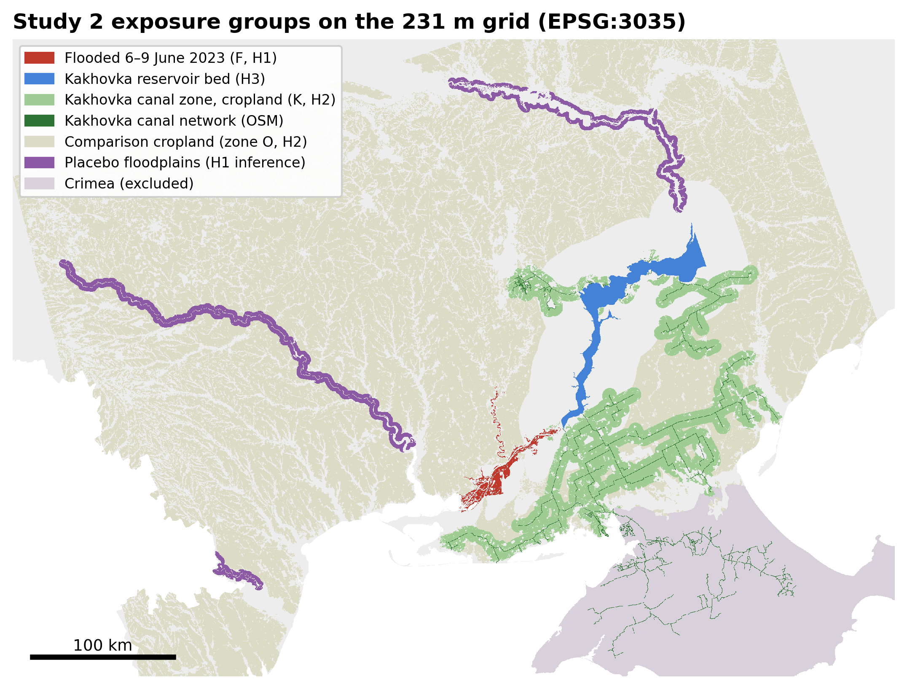
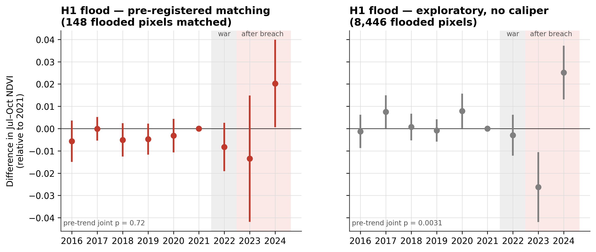
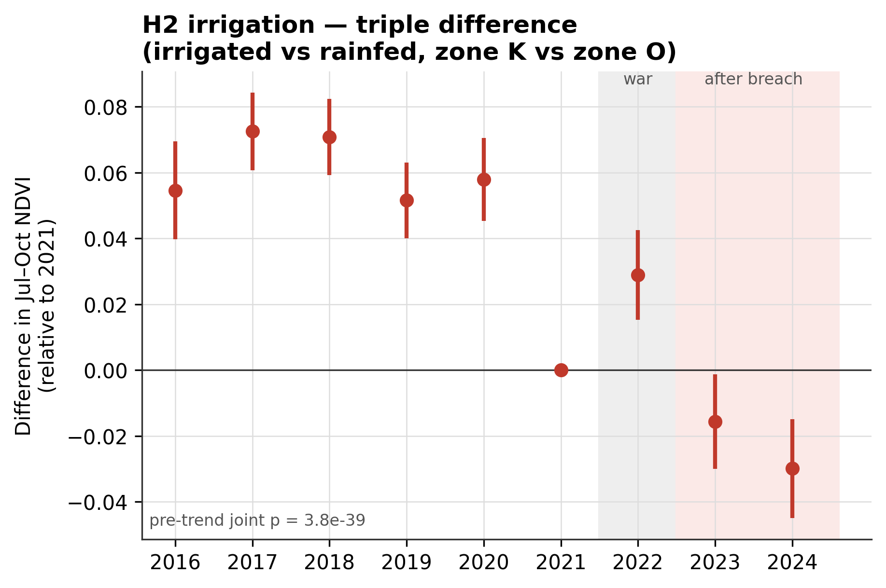
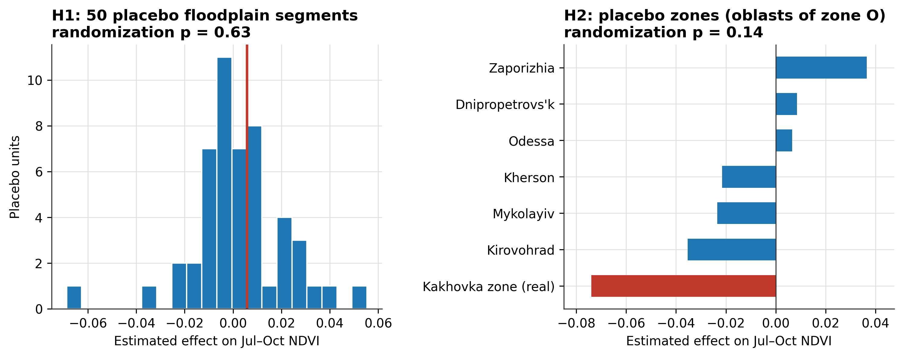
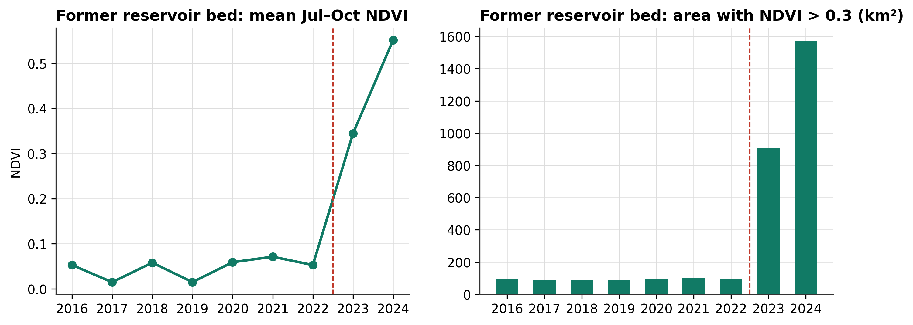
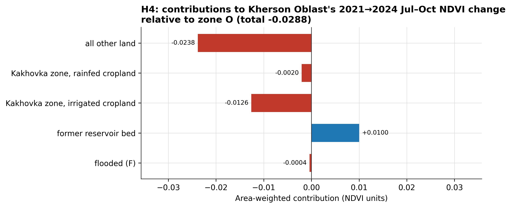
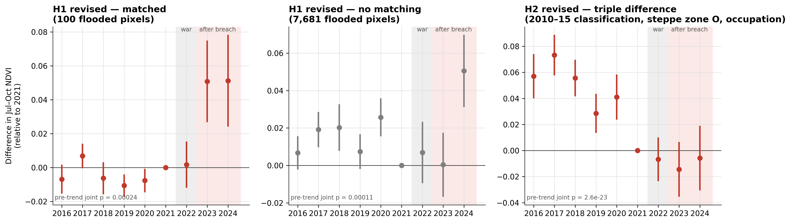

# What Did the Destruction of the Kakhovka Dam Do to Vegetation? Separating Flood, Reservoir and Irrigation Effects with Satellite Data

**Sakshi D. Maske**

*Independent Geospatial Researcher*

## Abstract

The Kakhovka Dam in southern Ukraine was destroyed on 6 June 2023. This could have changed vegetation in three ways: through the flood below the dam, the draining of the reservoir, and the loss of water for the irrigation canals. All three happened inside an active war zone.

I tested each pathway separately with MODIS NDVI at 250 m resolution for 2016–2024. Treated land was defined by what physically happened to it, and it was compared with similar land in the same war zone. I wrote the analysis plan and made it public before downloading any data.

- **Flooded land** did not lose summer greenness compared with similar unflooded land (+0.006 NDVI, 95% CI −0.014 to 0.026), except for floodplain wetlands (−0.04 to −0.06).
- **Irrigated farmland** near the canals showed a large relative decline (−0.074). A registered revision found that this decline had already happened by 2021, before the invasion, and that there was no further change after the breach.
- **The drained reservoir bed** changed the most: the area with NDVI above 0.3 grew from about 95 km² before the breach to 1,574 km² in 2024.

Most of the fall in Kherson Oblast's greenness came from land that was not exposed to any of the three pathways. Satellite data can show what happened to the reservoir. They cannot yet attribute changes on farmland to the dam.

**Keywords**: Kakhovka Dam, armed conflict, NDVI, MODIS, pre-registration, difference-in-differences, irrigation, reservoir drawdown, ecocide

---

## 1. Introduction

On 6 June 2023 the Kakhovka Dam on the lower Dnipro River was destroyed. The reservoir behind it held about 18 km³ of water at full capacity (Vyshnevskyi et al., 2023). It emptied within days. The floodplain between the dam and the Dnipro–Buh estuary was flooded. The main irrigation canals of southern Ukraine lost their water source (Shumilova et al., 2025). The event is one of the most cited examples of environmental harm in the war and is often mentioned in debates about making ecocide an international crime.

To link a change in the environment to one act, we need to know what would have happened without that act. In southern Ukraine this is hard. The region had been a battlefield since February 2022. The left bank of the Dnipro was occupied. Farming was disrupted, and vegetation changes from year to year with the weather.

In an earlier version of this work (Study 1, Section 3) I compared the average NDVI of the whole of Kherson Oblast with four counties in Romania. Kherson became less green after June 2023, and the difference was statistically significant. But that design could not show that the dam caused the change.

This paper uses a different design. I asked three questions, one for each pathway:

1. Did land that was flooded lose greenness compared with similar land that was not flooded?
2. Did irrigated farmland near the reservoir's canals lose greenness compared with rainfed farmland, more than irrigated farmland elsewhere did?
3. What happened to vegetation on the drained reservoir bed?

I then used the answers to split Kherson Oblast's overall change into parts.

I wrote the full analysis plan before downloading any data and made it public on GitHub. The plan also fixed the words I would use to describe each result. When the first results showed five problems in the design, I wrote a second, registered plan before collecting the extra data it needed. I report both sets of results.

The main finding is simple: the three pathways behave very differently. The reservoir bed turned green on a large scale. The flood left no lasting loss of greenness on the land it covered, except in wetlands. The farmland decline cannot be linked to the dam, because it started before the war. An average over a whole oblast mixes all of these, and it mostly shows changes that have nothing to do with the dam.

## 2. Background

### 2.1 Legal context

Article 8(2)(b)(iv) of the Rome Statute covers attacks that cause "widespread, long-term and severe damage to the natural environment" (Rome Statute, 1998). In September 2024 Vanuatu, Fiji and Samoa proposed adding a separate crime of ecocide to the Statute (Stop Ecocide International, 2024). Ukraine's Criminal Code already has such a crime (Article 441), and Belgium added one in 2024 (Atılgan Pazvantoğlu, 2025). How it would apply in war is still debated (Killean, 2025).

Any case would need evidence that links an environmental change to a specific act. Satellite images have been used in international courts, for example in *Prosecutor v. Al Mahdi* (2016). They have mostly supported other evidence, and there are no agreed rules for how to read them in numbers (Kroker, 2015; Wang et al., 2013).

### 2.2 What is already known about the Kakhovka event

**The dam and the flood.** Satellite data show that the dam was being run in an unusual way for months before it failed, with water overflowing from late April 2023 (Yang et al., 2024). UNOSAT mapped the flood within days from several satellites (UNITAR/UNOSAT, 2023). Field and model studies describe the flood, pollution and effects on rivers and the sea (Shumilova et al., 2025; Vyshnevskyi et al., 2023).

**The reservoir bed.** Kuzemko et al. (2025) combined field surveys with satellite mapping of the drained bed. They found that the number of plant species grew almost fourteen-fold within a year and that willow and poplar thickets spread quickly. This did not match early warnings that the bed would become a desert.

**Irrigation.** Baber et al. (2026) mapped irrigated fields in Kherson and Zaporizhzhia oblasts for 2019–2025 at 30 m. They used Sentinel-2, Landsat, rainfall and evapotranspiration data. The accompanying NASA Harvest analysis reports that irrigated area in the two oblasts fell by about 90% by summer 2024, and that farmers moved from summer crops to winter wheat and barley (NASA Harvest, n.d.).

**War and farmland.** Kussul et al. (2025) found that Ukraine's arable land shrank by about 10% after the invasion, with more than 5 million hectares left uncultivated by 2024. Wagner et al. (2025) showed that abandoned cropland is concentrated near the front line and where fighting is heavy.

### 2.3 What is missing

Each of these studies describes one part of the picture. None of them asks how much of the change in vegetation after June 2023 was caused by each pathway of the dam's destruction, compared with what would have happened anyway inside the same war zone. That comparison is what legal and recovery questions need. It is what this paper tries to do.

## 3. Study 1: why an oblast-wide comparison was not enough

Study 1 used monthly Sentinel-2 NDVI from January 2022 to November 2024. It compared the whole of Kherson Oblast with Tulcea County in Romania and three other Romanian counties.

**What it found.**

- Kherson's NDVI fell relative to Tulcea by 0.108 (95% CI 0.007 to 0.209; p = 0.037).
- With separate seasonal patterns for each area, the fall was 0.069 (p = 0.005).
- A fake event date in June 2022 showed no effect.

**Why this could not show the dam was the cause.**

- When each of the five areas was treated as the "affected" one in turn, Kherson ranked only second (p = 0.40).
- Four of the five quarters before the event already showed differences.
- The flood covered only about 2% of the oblast. Even if every flooded pixel had lost all its vegetation, the oblast average would have moved by only about 0.02.
- The result also changed across three versions of the data processing.

Study 1 therefore showed a real decline, but not its cause. Its problems shaped every choice in Study 2.

## 4. Data and methods

### 4.1 Analysis plans

**Main plan.** I wrote the plan (`ANALYSIS_PLAN_v2.md`) and committed it to the public GitHub repository at 15:33 IST on 24 September 2026 (commit 521672f). The first data file was downloaded about 20 minutes later. The plan fixes:

- the questions;
- how each exposed group is defined;
- the outcome;
- the statistical models and tests;
- nine robustness checks;
- the rule that decides whether a result is called *supported*, *suggestive* or *not supported*.

**Registered revision.** The first results showed five problems (Section 4.8). I wrote a second plan (`ANALYSIS_PLAN_v2_ADDENDUM_1.md`) and committed it at 22:53 IST on the same day (commit 30e3840). This was after I had seen the first results, but before I downloaded the extra data it needed and before I ran any of its analyses.

**Deviations.** Every change to the plans, and every choice the plans did not cover, is listed in `v2/DEVIATIONS.md`.

### 4.2 Data

All data were put on one equal-area grid (EPSG:3035) with 231.656 m pixels, the true pixel size of the MODIS 250 m product. The grid covers 29.0–36.5 °E and 45.3–49.3 °N.

| Dataset | Used for | Source |
|---|---|---|
| MODIS Terra MOD13Q1 v061, 16-day composites, 2010–2024 | NDVI and EVI outcomes; irrigation status in the revision | Didan (2021), Microsoft Planetary Computer |
| ESA WorldCover 2021 v200, 10 m | Share of each land-cover class in each pixel | Zanaga et al. (2022) |
| UNOSAT FL20230606UKR | Flood extent; water extent before the breach | UNITAR/UNOSAT (2023) |
| ERA5-Land monthly means, 2015–2024 | July–October rainfall and temperature | Muñoz-Sabater et al. (2021) |
| OpenStreetMap canals | Irrigation network | OpenStreetMap contributors (2026) |
| VIINA events and territorial control, 2022–2024 | War intensity and occupation (revision) | Zhukov (2023) |
| Impact Observatory annual land cover, 2017–2023 | Yearly water share of each pixel (revision) | Karra et al. (2021) |
| GADM v4.1 | Country, oblast and district borders | GADM (2022) |

Of the 207 MODIS composites expected for 2016–2024, 204 were in the catalogue. One of the three missing composites (12 August 2024) falls in the outcome window.

**Study pixels.** I used pixels inside Ukraine with at least 90% valid land-cover data. Crimea was left out. This gives 3.49 million pixels.

### 4.3 Outcome

**Main outcome.** The main outcome is the average NDVI of each pixel from July to October of each year.

- Only observations marked good or marginal by MODIS are used.
- Each observation is placed in a season by its own acquisition date.
- A pixel-year is left empty if it has fewer than five valid observations.
- A pixel is used only if it has a value in at least seven of the nine years.

The July–October window means that all of 2023 in the outcome comes after the breach.

**Periods.**

- 2016–2021: before the war
- 2022: the war year before the breach
- 2023–2024: after the breach

**Secondary outcomes.**

- July–August NDVI
- April–October NDVI (without 2023)
- July–October EVI
- for farmland, whether a field was cropped at all

### 4.4 Exposed and comparison groups (Figure 1)

**Flooded land (question 1).**

- A pixel counts as flooded if at least half of it lies inside UNOSAT's combined flood map for 6–9 June 2023 and it is less than 20% permanent water. This gives 9,247 pixels, or 500 km².
- Comparison pixels lie 2–15 km from the flood, were not flooded in any of the 13 UNOSAT flood maps from June 2023, and are on the same river bank.
- I traced the main channel of the Dnipro through the water that was there before the breach. I used it to split the land into the right bank, which was back under Ukrainian control from November 2022, and the left bank, which stayed occupied.
- Within each bank and land-cover type, each flooded pixel was matched to three comparison pixels with the most similar July–October NDVI in 2016–2021.

**Reservoir bed (question 3).** The reservoir bed is the largest connected body of WorldCover water between the Kakhovka and Zaporizhzhia dams. It covers 1,812 km² on the grid.

**Irrigated and rainfed farmland (question 2).**

- The canal network is the OpenStreetMap canals that start near the reservoir, plus every canal connected to them. This gives 1,879 canal segments, 3,264 km in total.
- The canal zone (K) is cropland within 5 km of this network.
- The comparison zone (O) is cropland more than 30 km from the reservoir and more than 5 km from the network.
- In the main plan, a field counted as irrigated if its July–August NDVI was at least 0.45 in three of the five years 2017–2021. It counted as rainfed if its July–August NDVI was below 0.35 in four of those five years.

**Placebo units.** These are places that were not affected, analysed in exactly the same way as the real ones.

- For the flood: 141 river-side strips 10 km long along the Southern Buh, the lower Dniester and the Dnipro above Zaporizhzhia.
- For irrigation: each oblast of zone O (main plan) or each district (revision), treated as if it were the canal zone.

### 4.5 Models

**Flood (H1).** For pixel *i* in year *y*:

Yiy = αi + λy,s + β·Fi·Posty + δ·Fi·Wary + γ′Wiy + εiy

- αi: pixel effects
- λy,s: year effects for each bank and land-cover group
- F: flooded
- W: July–October rainfall and temperature

**Irrigation (H2).**

Yiy = αi + λy,oblast + μy,irrigated + κy,zone + β·Irri·Ki·Posty + δ·Irri·Ki·Wary + γ′Wiy + εiy

In both models:

- β is the main result: the change after the breach, compared with 2016–2021.
- δ is the change in the war year before the breach.
- The year-by-year version replaces Post and War with one term for each year, with 2021 as the reference.

### 4.6 Tests

- Standard errors are clustered on 10 km blocks.
- A wild cluster bootstrap with 9,999 draws gives p-values that do not depend on large-sample rules (Cameron et al., 2008).
- Conley (1999) standard errors allow for correlation up to 25 km.
- Placebo tests compare the real estimate with the estimates for the placebo units.
- The Holm (1979) correction adjusts for testing two main questions.
- Pre-trends are tested jointly on the 2016–2020 coefficients.
- I used the relative-magnitudes idea of Rambachan and Roth (2023) to ask how large a break from parallel trends would be needed to explain the result. I wrote my own, more conservative version of this step; it is not the HonestDiD software (details in `v2/DEVIATIONS.md`).

### 4.7 Rule for naming results (fixed in the plan)

- **Supported:** β is negative; the Holm-adjusted bootstrap p is below 0.05; the placebo p is below 0.10; and the sensitivity interval at M̄ = 1 excludes zero.
- **Suggestive:** β is negative with p below 0.05, but one of the other conditions fails. Here p is the cluster-robust p-value.
- **Not supported:** all other cases.

### 4.8 What the registered revision changed

The first results showed five problems, and the revision addressed each one.

| Problem | Change in the revision |
|---|---|
| Irrigation status came from the same years as the outcome (2017–2021) | Irrigation status measured from 2010–2015 |
| Outside the dry south, the NDVI rule labelled rainfed summer crops as irrigated | Comparison zone limited to the four steppe oblasts (Odesa, Mykolaiv, Kherson, Zaporizhzhia) |
| Only six placebo oblasts, so the placebo p could not go below 0.14 | Districts used as placebo units |
| War intensity and occupation were not in the models | Added from VIINA: occupation status of the nearest settlement on 1 August, and war events within 5 km. H1 also got year effects by distance to the river channel; H2 got year effects by irrigation and occupation. |
| Each pixel's water share was fixed at 2021, although river levels changed after the breach | Yearly water share from Impact Observatory land cover; pixel-years with more than 10% water, or a change of more than 10 points from 2021, removed |

**Other deviations** (all in `v2/DEVIATIONS.md`):

- A Bartlett kernel was used for the Conley standard errors, because the plan did not name one and a flat kernel failed in the small H1 sample.
- In the flood placebo test, strips with fewer than ten matched pixels were dropped (50 of 141 remain).
- In the revision, only VIINA events classed as military were counted, and contested settlements were treated as not occupied.

## 5. Results

*Figure 1. Flooded land, reservoir bed, canal zone (K), comparison zone (O) and placebo floodplains on the 231 m grid.*

### 5.1 The flood (H1)

**Few good matches.** Before the war, flooded land was much greener in July–October than unflooded land 2–15 km away: the difference was about two standard deviations every year. Most flooded pixels are floodplain wetland or riverside forest, and there is almost no unflooded land like it on the same bank. On the right bank, for example, there were 1,171 flooded wetland pixels but only 24 possible comparison pixels. The planned matching rule therefore found good matches for only 148 of 8,446 flooded pixels (1.8%). For those 148 pixels the match is very close (differences of 0.02 standard deviations or less).

**Main result.**

- β = +0.006 NDVI (95% CI −0.014 to 0.026).
- Bootstrap p = 0.60; Conley standard error 0.014.
- No pre-trend (joint p = 0.72).
- Among 50 placebo floodplains the real estimate is ordinary (placebo p = 0.63).

The result is **not supported**: flooded land did not lose greenness.

**All flooded pixels.** Without matching, using all 8,626 flooded pixels, the estimate is +0.011 (95% CI −0.004 to 0.025; p = 0.15; placebo p = 0.70 among 141 strips). None of the other planned checks shows a decline. One of them, the wider comparison band, shows a significant increase:

| Check | β | p | Matched flooded pixels |
|---|---|---|---|
| Comparison band 5–25 km | +0.024 | 0.007 | 163 |
| No weather terms | +0.004 | 0.68 | 148 |
| Flood threshold 25% | +0.011 | 0.24 | 186 |
| Flood threshold 75% | +0.004 | 0.74 | 137 |
| EVI instead of NDVI | +0.006 | 0.30 | 224 |
| Right bank only | +0.001 | 0.95 | 21 |
| Left bank only | +0.006 | 0.61 | 127 |
| More than 3 km from built-up land | +0.000 | 0.98 | 8 |

**Two patterns inside the flood area.**

- **Wetlands lost greenness.** Flooded wetland pixels fell by 0.059 in the matched sample (p = 0.004; 44 pixels) and by 0.041 over all 4,899 flooded wetland pixels (95% CI −0.062 to −0.020). Flooded grassland, cropland, trees and built-up land show zero or positive changes.
- **A short dip, then regrowth.** Matching without the size limit, which was not in the plan, shows a dip in 2023 (−0.026, p = 0.001) and greener-than-normal land in 2024 (+0.025, p < 0.001; Figure 2). Its pre-trend test fails (p = 0.003), so I treat this only as a description. The planned April–October outcome (without 2023) points the same way: +0.050 (p < 0.001).

**Revision.** With yearly water masks, war intensity and distance to the river added, the matched sample shrinks to 100 flooded pixels.

- Flooded land is greener than its matches after the breach: β = +0.055 (95% CI 0.034 to 0.076), with +0.051 in both 2023 and 2024 (Figure 7).
- Its pre-trend test fails (p = 0.0002), and the plan tests for a decline, so the result stays **not supported**.
- Without matching (7,681 pixels) the estimate is +0.012 (p = 0.13).
- Wetlands still decline (−0.061, 95% CI −0.081 to −0.041; 4,258 pixels).

*Figure 2. Flooded minus matched unflooded land, each year compared with 2021. Left: planned matching (148 pixels). Right: matching without the size limit, not in the plan (8,446 pixels). Bars are 95% confidence intervals.*

### 5.2 Irrigated farmland (H2)

**Main plan.**

- The main plan found 97,344 irrigated and 22,926 rainfed pixels in the canal zone, and 1,362,498 irrigated and 106,863 rainfed pixels in the comparison zone.
- The estimate is large: β = −0.074 NDVI (95% CI −0.088 to −0.060). This is 15% of the pre-war level of irrigated land in the canal zone.
- Bootstrap p < 0.001 (Holm 0.0002).
- It holds across the planned checks (−0.062 to −0.092), except in the Zaporizhzhia part of the canal zone (−0.019, p = 0.10).

But the year-by-year results (Figure 3) show that this is not a change that starts with the breach:

- The canal-zone contrast was 0.05–0.07 higher in every year from 2016 to 2020 than in 2021.
- It was +0.029 in 2022, −0.016 in 2023 and −0.030 in 2024.
- The pre-trend test fails badly (p < 10⁻³⁸).
- Among six placebo oblasts, the canal zone had the most negative estimate (Figure 4). With only six placebos, the smallest possible p is 0.14.

**Revision.**

- With irrigation measured from 2010–2015, the comparison limited to the steppe, and occupation and war intensity added, β is −0.053 (95% CI −0.074 to −0.032; bootstrap p = 0.0001).
- The year-by-year results are clearer (Figure 7). The contrast fell between 2020 and 2021 and then stayed flat: −0.007 in 2022, −0.014 in 2023 (p = 0.18) and −0.006 in 2024 (p = 0.65), all compared with 2021.
- Among 15 placebo districts the canal zone ranks sixth (placebo p = 0.38).
- The war-year term is negative (δ = −0.049, p < 0.001).

**What this means.** The rule in the plan names this result **suggestive**, because β is negative and significant while the placebo and sensitivity conditions fail. The content of the result is plainer: **I found no change in the greenness of canal-zone farmland after the breach.** The relative decline had already happened by 2021.

This does not mean irrigation did not stop. Baber et al. (2026) and NASA Harvest (n.d.) show a fall of about 90% in irrigated area. Section 6.2 discusses why my design did not detect it.

*Figure 3. Irrigated minus rainfed farmland, canal zone minus comparison zone, each year compared with 2021 (main plan). Bars are 95% confidence intervals.*

*Figure 4. Placebo tests. Left: flood estimate (red line) against 50 placebo floodplains. Right: irrigation estimate against six placebo oblasts.*

### 5.3 The reservoir bed (H3)

Before the breach the reservoir pixels were open water. Their July–October NDVI averaged 0.01–0.07, and only about 86–100 km² had NDVI above 0.3, mostly shallow edges and islands. After the breach this changed fast (Figure 5).

| | Mean July–October NDVI | Area with NDVI above 0.3 |
|---|---|---|
| 2016–2022 | 0.01–0.07 | about 86–100 km² |
| 2023 | 0.34 | 906 km² |
| 2024 | 0.55 | 1,574 km² (88% of valid pixels) |

This is a description; there is nothing to compare it with. The revision keeps only pixels that the yearly land-cover map calls land. Because that map still shows most of the bed as water in 2023, this leaves 244 km². On that land NDVI was 0.37 in 2023 and 0.55 in 2024, the same path. These numbers fit the field results of Kuzemko et al. (2025).

*Figure 5. The former Kakhovka reservoir bed: mean July–October NDVI and area with NDVI above 0.3.*

### 5.4 What made up Kherson Oblast's change (H4)

From 2021 to 2024, the July–October NDVI of Kherson Oblast fell by 0.029 more than the same land-cover types in the comparison zone. Weighted by area, the parts are:

| Part of the oblast | Contribution (NDVI) |
|---|---|
| Land not exposed to any pathway | −0.024 |
| Irrigated farmland in the canal zone | −0.013 |
| Rainfed farmland in the canal zone | −0.002 |
| Flooded land | −0.0004 |
| Reservoir bed turning green | +0.010 |

The flood contributed almost nothing. The irrigated farmland of the canal zone contributed about a third of the decline, but Section 5.2 shows that its drop started before the breach. Most of the decline came from land that was neither flooded nor served by the canals (Figure 6).

In the revision, the water rule removes the whole reservoir bed by design, because every bed pixel's water share changed. The total is then −0.052, with −0.039 from unexposed land.

*Figure 6. Contributions to Kherson Oblast's change in July–October NDVI from 2021 to 2024, compared with zone O.*

*Figure 7. Year-by-year results under the registered revision, compared with 2021. Left: flood, matched. Centre: flood, not matched. Right: irrigation.*

## 6. Discussion

### 6.1 Three pathways, three different answers

**The reservoir bed.** This is the largest and clearest change. About 1,500 km² became green within two seasons. Whether this is recovery or a new risk, for example from polluted sediment, needs field work (Kuzemko et al., 2025; Shumilova et al., 2025). NDVI only measures greenness.

**The flood.** The flood did not leave a lasting loss of summer greenness on the land it covered. In 2024 flooded land was, if anything, greener than similar land nearby, which fits a short flood that left moisture and sediment. Floodplain wetlands are the exception: their greenness fell in every version of the analysis. After the dam's loss the river below it is no longer regulated, and its level dropped. This may have dried the wetlands more than the flood itself harmed them. My design cannot separate these two causes.

**Irrigated farmland.** This is the pathway where my results and other evidence seem to disagree.

### 6.2 Why the irrigation loss was not detected

Baber et al. (2026) and NASA Harvest (n.d.) show that irrigation in Kherson and Zaporizhzhia almost stopped after the breach. My design did not find a matching fall in greenness. I see three reasons.

1. **My irrigation measure is weak.** I marked a field as irrigated if it stayed green in July and August. In the steppe this mostly picks up summer crops such as maize and sunflower, which are often not irrigated. Even with 2010–2015 data, 95% of the steppe farmland classed as irrigated or rainfed outside the canal zone was classed as "irrigated". So my "irrigated" group is mostly "summer-cropped", not "irrigated".
2. **The trend was already moving.** The canal-zone contrast fell between 2020 and 2021, before the war. A change after 2023 would have had to stand out against this earlier movement, and it did not.
3. **The comparison groups also changed.** After the breach, farmers in the canal zone moved to winter crops (NASA Harvest, n.d.). The same shift, for other reasons such as prices and war risk, may have happened in the comparison zone too. This would hide the difference.

So my design could not test the irrigation pathway well. It is not evidence that the loss of irrigation had no effect. Field-level irrigation maps such as those of Baber et al. (2026) are the right tool for this question.

### 6.3 Why an oblast average misleads

Study 1's decline across Kherson Oblast was real. H4 shows that most of it came from land outside every pathway of the dam, and that the greening reservoir bed hid part of it. An oblast average adds together a flood effect near zero, a farmland decline that started before the war, a large gain on the reservoir bed and a broad war-related decline. Its size and even its sign depend on where the borders are drawn. To link change to an act, the units of analysis must match the physical footprint of each pathway.

### 6.4 What fixing the plan in advance changed

Two results would have been easy to change after seeing them.

- **The flood matching rule** kept only 1.8% of the flooded area. A looser rule chosen afterwards would have given a significant 2023 dip as the headline.
- **The irrigation naming rule** needed a placebo p that six oblasts could not give. A looser rule would have turned "suggestive" into "supported".

I kept both as written, reported the alternatives separately, and wrote the revision before collecting its data. Without these steps, this paper could have claimed a flood effect and an irrigation effect that the data do not show.

### 6.5 What this means for legal use

- The change on the reservoir bed is large, well measured and clearly linked to the dam.
- The flood's direct effect on vegetation was short, except in wetlands.
- A loss of greenness on canal-irrigated farmland after the breach could not be shown with this design, even though other data show that irrigation stopped.

None of these results say anything about intent, military necessity or responsibility.

## 7. Limitations

- **Irrigation measure.** Irrigation status is based on NDVI and mostly captures summer cropping (Section 6.2). This is the main weakness of H2.
- **Parallel trends.** Pre-trend tests fail in every specification I tested except the planned flood sample. Causal readings of β should be made with care; the year-by-year results are more informative.
- **Few good flood matches.** Flooded floodplain has few unflooded look-alikes, so the matched flood samples are small (148 and 100 pixels) and not typical of the whole flooded area.
- **Placebo tests.** Only six placebo oblasts were possible in the main plan and 15 districts in the revision.
- **Timing of the revision.** The revision was written after the first results were known. It is reported next to them, not instead of them. Both plans are timestamped only by GitHub commits.
- **Exposure maps.**
  - UNOSAT flood maps are preliminary.
  - OpenStreetMap canals show today's mapping.
  - Land cover is from 2021.
  - The yearly water map for 2023 mixes months before and after the breach, and there is no 2024 map.
- **War data.** VIINA is built from news reports, so some areas are under-reported. Mines and abandoned fields are not measured directly.
- **What NDVI can show.** NDVI shows greenness only, not crop yield, species, soil pollution or salt. The July–October window misses spring crops.
- **Sensor and time span.**
  - MODIS 250 m pixels mix land types at field edges.
  - One composite in the 2024 outcome window is missing.
  - Only two seasons after the breach are available.
- **Statistical tools.** The bootstrap, Conley and Rambachan–Roth steps were written for this study, not taken from standard software. They were checked against direct calculations but not against those packages.

## 8. Conclusion

I used a design fixed before seeing the data, and a registered revision fixed before collecting its extra data. With them I found that:

- the drained reservoir bed became about 1,500 km² of green land within two seasons;
- flooded land did not lose summer greenness, except for floodplain wetlands;
- the relative decline of canal-zone farmland started before the war and did not deepen after the breach. My NDVI-based measure could not detect the loss of irrigation shown by other sources.

Most of Kherson Oblast's overall decline came from land outside all three pathways. Satellite evidence of war damage is most useful when the analysis follows the physical footprint of each pathway, compares like with like inside the conflict zone, and is fixed in advance.

## Data and Code Availability

All code, both analysis plans, the list of deviations and all results are at github.com/sakshimaske303-commits/ECOCIDE.

- `v2/01`–`08` download and prepare the data.
- `v2/analysis/run_all.py` reproduces the main-plan results (`outputs/v2/study2_summary.json`).
- `v2/analysis/run_revision.py` reproduces the revision (`outputs/v2/r1_summary.json`).
- Study 1 is reproduced by `generate_model_results.py`.

The input data are open: MODIS, WorldCover and Impact Observatory maps from the Microsoft Planetary Computer; ERA5-Land from the Copernicus Climate Data Store; UNOSAT layers from UNITAR/UNOSAT; canals from OpenStreetMap (ODbL); conflict data from VIINA.

## References

Atılgan Pazvantoğlu, C. (2025). Ecocide as a separate crime under the Rome Statute: A legal analysis of the discourse. *Environmental Policy and Law*, 55(2–3), 57–67. https://doi.org/10.1177/18785395251351171

Baber, S., Skakun, S., Sadeh, Y., Shumilo, L., Oliinyk, O., Hosseini, M., Wagner, J., Khan, A. Q., Sreedharan Nair, S., Kotcharlakota, A., & Becker-Reshef, I. (2026). *Irrigation of Kherson and Zaporizhzhia 2019–2025* (Version 1) [Data set]. Zenodo. https://doi.org/10.5281/zenodo.22036773

Cameron, A. C., Gelbach, J. B., & Miller, D. L. (2008). Bootstrap-based improvements for inference with clustered errors. *The Review of Economics and Statistics*, 90(3), 414–427. https://doi.org/10.1162/rest.90.3.414

Conley, T. G. (1999). GMM estimation with cross sectional dependence. *Journal of Econometrics*, 92(1), 1–45. https://doi.org/10.1016/S0304-4076(98)00084-0

Didan, K. (2021). *MODIS/Terra Vegetation Indices 16-Day L3 Global 250m SIN Grid V061* [Data set]. NASA EOSDIS Land Processes DAAC. https://doi.org/10.5067/MODIS/MOD13Q1.061

GADM. (2022). *GADM database of global administrative areas, version 4.1*. https://gadm.org

Holm, S. (1979). A simple sequentially rejective multiple test procedure. *Scandinavian Journal of Statistics*, 6(2), 65–70.

Karra, K., Kontgis, C., Statman-Weil, Z., Mazzariello, J. C., Mathis, M., & Brumby, S. P. (2021). Global land use/land cover with Sentinel 2 and deep learning. In *2021 IEEE International Geoscience and Remote Sensing Symposium (IGARSS)* (pp. 4704–4707). https://doi.org/10.1109/IGARSS47720.2021.9553499

Killean, R. (2025). Ecocide's evolving relationship with war. *Environment and Security*. Advance online publication. https://doi.org/10.1177/27538796251347111

Kroker, P. (2015, April 23). Satellite imagery as evidence for international crimes. *International Justice Monitor*. https://www.ijmonitor.org/2015/04/satellite-imagery-as-evidence-for-international-crimes/

Kussul, N., Shelestov, A., Yailymov, B., Yailymova, H., Lemoine, G., & Deininger, K. (2025). Assessment of war-induced agricultural land use changes in Ukraine using machine learning applied to Sentinel satellite data. *International Journal of Applied Earth Observation and Geoinformation*, 140, 104551. https://doi.org/10.1016/j.jag.2025.104551

Kuzemko, A. A., Prylutskyi, O. V., Kolomytsev, G. O., Didukh, Ya. P., Moysiyenko, I. I., Borsukevych, L. M., Chusova, O. O., & Khodosovtsev, O. Ye. (2025). Initial stages of revegetation at the bottom of the drained Kakhovka Reservoir (Ukraine): Synthesis of field surveys and remote sensing. *Ukrainian Botanical Journal*, 82(5), 488–501. https://doi.org/10.15407/ukrbotj82.05.488

Muñoz-Sabater, J., Dutra, E., Agustí-Panareda, A., et al. (2021). ERA5-Land: A state-of-the-art global reanalysis dataset for land applications. *Earth System Science Data*, 13(9), 4349–4383. https://doi.org/10.5194/essd-13-4349-2021

NASA Harvest. (n.d.). *Tracking irrigation loss in southern Ukraine after the Kakhovka Dam collapse*. Retrieved 28 September 2026, from https://www.nasaharvest.org/news/tracking-irrigation-loss-in-southern-ukraine-after-the-kakhovka-dam-collapse

OpenStreetMap contributors. (2026). *OpenStreetMap* [Data set, extracted 24 September 2026 through the Overpass API]. https://www.openstreetmap.org

*Prosecutor v. Ahmad Al Faqi Al Mahdi*, ICC-01/12-01/15, Judgment and Sentence (International Criminal Court, Trial Chamber VIII, 27 September 2016).

Rambachan, A., & Roth, J. (2023). A more credible approach to parallel trends. *The Review of Economic Studies*, 90(5), 2555–2591. https://doi.org/10.1093/restud/rdad018

Rome Statute of the International Criminal Court, July 17, 1998, 2187 U.N.T.S. 90.

Shumilova, O., Sukhodolov, A., Osadcha, N., et al. (2025). Environmental effects of the Kakhovka Dam destruction by warfare in Ukraine. *Science*, 387(6739), 1181–1186. https://doi.org/10.1126/science.adn8655

Stop Ecocide International. (2024, September 9). *Mass destruction of nature reaches International Criminal Court (ICC) as Pacific island states propose recognition of "ecocide" as international crime*. https://www.stopecocide.earth/2024/mass-destruction-of-nature-reaches-international-criminal-court-icc-as-pacific-island-states-propose-recognition-of-ecocide-as-international-crime

UNITAR/UNOSAT. (2023). *Flood extent analysis following the destruction of the Nova Kakhovka dam, Khersonska Oblast, Ukraine (event code FL20230606UKR)* [Data set]. United Nations Institute for Training and Research. https://unosat.org

Vyshnevskyi, V., Shevchuk, S., Komorin, V., et al. (2023). The destruction of the Kakhovka dam and its consequences. *Water International*, 48(5). https://doi.org/10.1080/02508060.2023.2247679

Wagner, J., Nair, S. S., Skakun, S., Duncan, E. C., Li, F., Oliinyk, O., Nerry, F., Rehbinder, J., & Becker-Reshef, I. (2025). Monitoring cropland cultivation, abandonment, fallowing and recultivation dynamics with regard to conflict intensity in war-affected Ukraine. *Science of Remote Sensing*, 12, 100326. https://doi.org/10.1016/j.srs.2025.100326

Wang, B. Y., Raymond, N., Gould, G., & Baker, I. (2013). Problems from hell, solution in the heavens? Identifying obstacles and opportunities for employing geospatial technologies to document and mitigate mass atrocities. *Stability: International Journal of Security and Development*, 2(3), Article 53. https://doi.org/10.5334/sta.cn

Yang, Q., Shen, X., He, K., Zhang, Q., Helfrich, S., Straka III, W., Kellndorfer, J. M., & Anagnostou, E. N. (2024). Pre-failure operational anomalies of the Kakhovka Dam revealed by satellite data. *Communications Earth & Environment*, 5, 230. https://doi.org/10.1038/s43247-024-01397-5

Zanaga, D., Van De Kerchove, R., Daems, D., et al. (2022). *ESA WorldCover 10 m 2021 v200* [Data set]. Zenodo. https://doi.org/10.5281/zenodo.7254221

Zhukov, Y. M. (2023). Near-real time analysis of war and economic activity during Russia's invasion of Ukraine. *Journal of Comparative Economics*. VIINA data: https://github.com/zhukovyuri/VIINA
