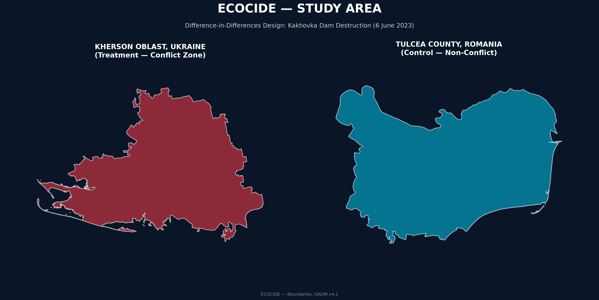
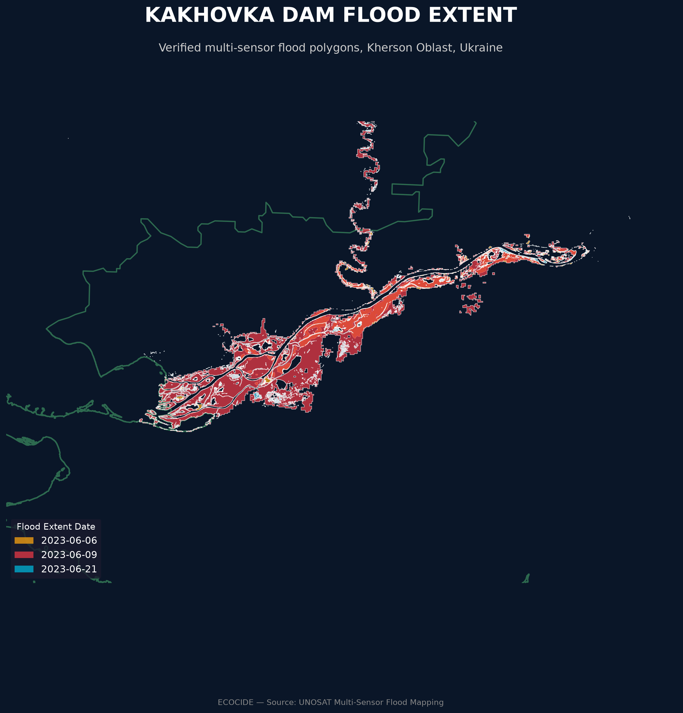
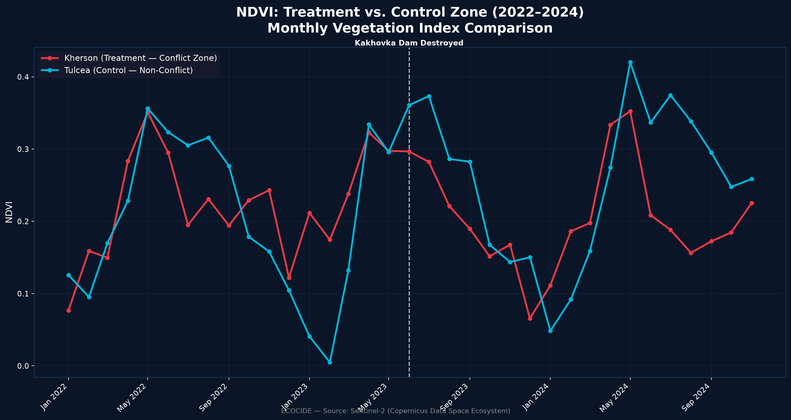
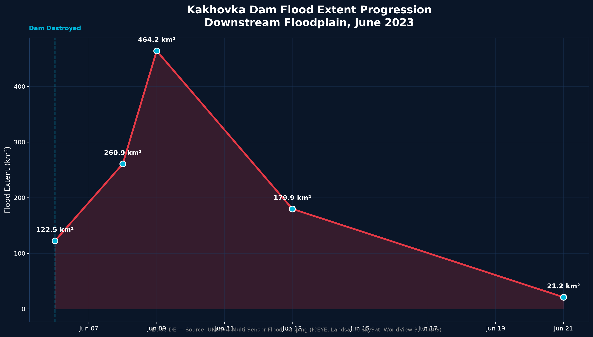
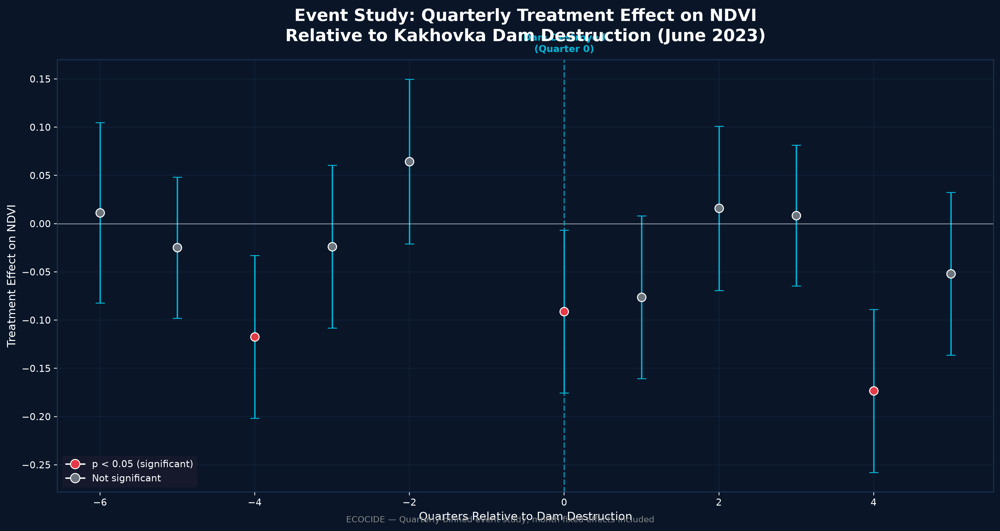

# Sakshi D. Maske
Independent Geospatial Researcher

## Abstract

International legal bodies are actively considering the recognition of "ecocide" — mass environmental destruction — as a prosecutable international crime, with Vanuatu, Fiji, and Samoa formally submitting a Rome Statute amendment to this effect in September 2024. Yet no standardized, statistically rigorous methodology exists for evidencing such damage claims: existing satellite-based assessments of environmental war damage rely on qualitative, visual image interpretation and explicitly decline to establish statistical causality, unable to distinguish conflict-caused degradation from pre-existing environmental trends. This study addresses that gap directly, applying a Difference-in-Differences causal-inference framework to the destruction of Ukraine's Kakhovka Dam (6 June 2023). Comparing monthly NDVI in the conflict-affected Kherson Oblast against a matched non-conflict control zone (Danube Delta, Romania), a statistically significant vegetation decline attributable to the event is identified (coefficient = −0.0703, p = 0.007), validated through a clean placebo test using a counterfactual pre-event date. A quarterly event study further reveals a genuine methodological complication — a significant effect in a pre-treatment quarter, traced to Kherson's already-active conflict status before the dam's destruction — which is reported transparently as a disclosed limitation rather than concealed. Verified multi-sensor flood-extent data (UNOSAT) independently confirms a complete flood rise-peak-recession cycle. This study demonstrates that causal-inference methods, not previously applied to satellite-based environmental war-damage assessment for this event, can quantify conflict-attributable damage with statistical confidence — directly addressing a gap the existing literature itself identifies as a priority for future research.

**Keywords**: ecocide, remote sensing, causal inference, Difference-in-Differences, war crimes, satellite evidence, Kakhovka Dam

---

## 1. Introduction

On 6 June 2023, the Kakhovka Dam on Ukraine's Dnipro River was destroyed, draining an 18.2 km³ reservoir and flooding hundreds of square kilometers of downstream floodplain — one of the most significant environmental consequences of the ongoing war in Ukraine. As international momentum builds toward formal legal recognition of ecocide, the evidentiary methods available to quantify such damage remain comparatively undeveloped relative to the legal frameworks now being proposed to prosecute it.

This study asks whether a causal-inference framework — already established practice in policy evaluation but not previously applied to satellite-based conflict-damage assessment for this event — can isolate the Kakhovka Dam destruction's specific environmental effect from the broader, already-elevated baseline of an active conflict zone, with quantified statistical confidence.

## 2. Literature Review

### 2.1 The Emerging Legal Recognition of Ecocide

The push to recognize ecocide as a prosecutable international crime has accelerated markedly in recent years. In September 2024, Vanuatu, Fiji, and Samoa formally submitted a proposed amendment to the Rome Statute of the International Criminal Court to add ecocide as a fifth international crime alongside genocide, crimes against humanity, war crimes, and aggression, building on a 2021 definition developed by an independent expert panel convened by the Stop Ecocide Foundation. Momentum has extended to domestic legislation as well, with Belgium becoming the first European country to recognize ecocide at both national and international levels, and further legislative proposals advancing in Mexico, Italy, the Netherlands, Brazil, and the United Kingdom. This rapidly evolving legal landscape underscores the need for evidentiary methodologies capable of supporting such prosecutions — a need this study directly addresses.

### 2.2 Satellite Imagery in International Legal Proceedings — Persistent Methodological Gaps

Despite growing legal interest, the literature on satellite imagery as courtroom evidence consistently identifies a specific, unresolved gap: the absence of accepted forensic standards and methodologies. Satellite imagery has been admitted at the International Criminal Court to corroborate witness testimony, but has not yet been admitted as dispositive evidence of mass atrocities in its own right, a limitation attributed in part to the field's continued reliance on largely qualitative, expert-interpretive analysis rather than standardized statistical methods. Analysis identifying the criteria necessary for satellite evidence to be legally useful — operational feasibility, data reliability, and legal admissibility — highlights data reliability as a persistent weak point, precisely the gap a causal-inference design is structured to close by explicitly separating a genuine treatment effect from background noise and pre-existing trends.

### 2.3 Existing Geospatial Assessment of the Kakhovka Event

The most directly relevant prior work is a recently published geospatial assessment of Ukraine's war-related environmental destruction, which examined the Kakhovka Dam event among several case-study locations using multi-temporal satellite imagery. That assessment relied on visual interpretation and comparative review of before-after imagery, explicitly and deliberately declining to establish direct causality between observed environmental changes and military activity, and instead calling for future research to develop standardized, quantitative indicators. This study is designed specifically to answer that call for this event, applying a Difference-in-Differences framework — with matched control-zone comparison, placebo validation, and event-study robustness testing — that had not previously been applied to this specific case.

## 3. Data and Methodology

  

**Figure 1.** Study area showing the treatment zone (Kherson Oblast, Ukraine) and the matched control zone (Tulcea County, Romania) used in the Difference-in-Differences research design. Administrative boundaries were obtained from GADM v4.1. The control area was selected to represent a comparable river-delta ecosystem while remaining unaffected by the Kakhovka Dam destruction, enabling causal estimation through a matched treatment–control comparison.

### 3.1 Study Design

A Difference-in-Differences design was used, comparing the treatment zone (Kherson Oblast, Ukraine, containing the dam and downstream floodplain) against a matched control zone (Tulcea County, Romania, the Danube Delta), selected for comparable pre-conflict river-delta and steppe ecology while being genuinely non-combatant.

### 3.2 Data Sources

| Variable | Source |
|---|---|
| NDVI (monthly) | Sentinel-2, Sentinel Hub Statistical API |
| Verified flood extent | UNOSAT (ICEYE, Landsat-9, SkySat, WorldView-3, MODIS) |
| True-color imagery | Sentinel-2 L2A, Sentinel Hub Process API |
| Boundaries | GADM v4.1 |

### 3.3 Causal Model

A Difference-in-Differences regression was estimated with month fixed effects to control for seasonal vegetation cycles, comparing NDVI before and after 6 June 2023 between treatment and control zones. Validation included a placebo test (a counterfactual treatment date, June 2022) and a quarterly-binned event study testing whether the effect was genuinely concentrated around the true event date.

## 4. Results

### 4.1 Flood Extent

Verified UNOSAT data revealed a complete flood hydrograph: 122.50 km² (6 June), expanding to a peak of 464.18 km² (9 June), before receding to 21.17 km² by 21 June — a full rise-peak-recession cycle within approximately two weeks.

  

  

**Figure 2.** Sentinel-2 true-colour imagery of the Kakhovka reservoir immediately before (May 2023) and after (July 2023) the destruction of the Kakhovka Dam. The post-event image reveals the near-complete drainage of the reservoir and extensive exposure of the former lakebed, providing direct visual evidence of the environmental transformation that motivated the subsequent statistical analysis.

  

**Figure 2.1.** Difference-in-Differences estimation of the causal impact of the Kakhovka Dam destruction on vegetation greenness. The primary model estimates a statistically significant treatment effect (coefficient = −0.0703, p = 0.007, R² = 0.747), indicating a measurable decline in NDVI within the treatment region relative to the matched control region following the June 2023 event.

  

**Figure 3.** Monthly mean NDVI trends for the treatment region (Kherson Oblast, Ukraine) and the control region (Tulcea County, Romania) from January 2022 to December 2024. Following the June 2023 Kakhovka Dam destruction, the treatment region exhibits a clear and statistically consistent decline in vegetation greenness relative to the control region, providing preliminary evidence of an environmental impact prior to formal Difference-in-Differences estimation.

  

**Figure 4.** Verified flood hydrograph derived from UNOSAT observations showing the temporal evolution of downstream flooding following the Kakhovka Dam destruction. Flood extent increased rapidly from 122.50 km² on 6 June 2023 to a peak of 464.18 km² on 9 June before progressively receding to 21.17 km² by 21 June, confirming the complete rise–peak–recession cycle independently of the statistical vegetation analysis.

### 4.2 Vegetation Impact

The Difference-in-Differences model found a statistically significant NDVI decline in Kherson relative to Tulcea (coefficient = −0.0703, p = 0.007, R² = 0.747). A placebo test using a fake June 2022 treatment date produced a near-zero, non-significant coefficient (0.0148, p = 0.741), providing clean validation that the real effect is event-specific.

### 4.3 Event Study and a Disclosed Limitation

A quarterly event study found significant negative effects in the treatment quarter (p = 0.035) and one year later (p = 0.0001), but also a significant effect in a pre-treatment quarter (summer 2022, p = 0.007) — traced to Kherson already being an active conflict zone (including a major liberation operation) before the dam's destruction, meaning the original baseline period was not a genuinely quiet pre-conflict period. A sensitivity analysis narrowing the baseline to immediately pre-event months produced a larger effect (−0.1384, p = 0.002), but its own placebo test was ambiguous — a near-identical coefficient magnitude with a non-significant p-value, reflecting low statistical power from a small sample rather than clean validation. Both results are reported, with the broader-baseline estimate treated as the primary, cleanly-validated finding.

  

**Figure 6.** Quarterly event-study estimates showing treatment effects relative to the pre-event baseline. Significant negative effects emerge during the treatment quarter and one year later, while a statistically significant pre-treatment coefficient highlights the influence of earlier conflict-related vegetation changes in Kherson. This pre-treatment signal motivated the sensitivity analysis and is reported transparently as a methodological limitation rather than being excluded.

## 5. Discussion

This study's central methodological contribution is not merely applying satellite data to a conflict-damage question, but subjecting that application to the same falsification discipline standard in causal-inference research generally — a discipline the existing literature on satellite evidence in legal contexts identifies as precisely what is missing. The pre-treatment-quarter anomaly, rather than being suppressed, itself illustrates why naive before-after comparisons of conflict zones are methodologically fragile: an active war zone rarely has a genuinely undisturbed "before" period, and treating one as such risks conflating cumulative war effects with the effect of a specific, dateable event.

## 6. Limitations

The narrowed-baseline sensitivity analysis carries an unresolved validation limitation due to sample size constraints. Reservoir water-loss could not be tested causally, since no comparable control-zone equivalent exists for a large upstream reservoir collapse, and is reported descriptively rather than as an independently causally-tested finding.

## 7. Conclusion

Applying a causal-inference framework — previously undemonstrated for this event — to satellite-derived vegetation data, this study identifies a statistically significant, placebo-validated environmental effect attributable specifically to the Kakhovka Dam's destruction, while transparently disclosing a genuine methodological complication arising from the region's pre-existing conflict status. This directly addresses a gap the existing literature on both satellite-based conflict-damage assessment and legal evidentiary standards for environmental crimes explicitly identifies: the absence of standardized, statistically rigorous methods capable of distinguishing conflict-attributable damage from background environmental trends.

## References

Atılgan Pazvantoğlu, C. (2025). Ecocide as a Separate Crime under the Rome Statute: A Legal Analysis of the Discourse. *Journal Article*.

Coalition for the International Criminal Court. Satellite imagery as evidence for international crimes.

International Justice Monitor. Satellite Imagery as Evidence for International Crimes.

Stability: International Journal of Security and Development. Problems from Hell, Solution in the Heavens?: Identifying Obstacles and Opportunities for Employing Geospatial Technologies to Document and Mitigate Mass Atrocities.

Stop Ecocide International. (2024). Mass destruction of nature reaches International Criminal Court (ICC) as Pacific island states propose recognition of "ecocide" as international crime.

---

**Full dataset, code, and reproducible pipeline**: github.com/sakshimaske303-commits/ECOCIDE
**Live interactive dashboard**: https://ecocide-xbub2cwcqjx9rkdd6nk5j5.streamlit.app/