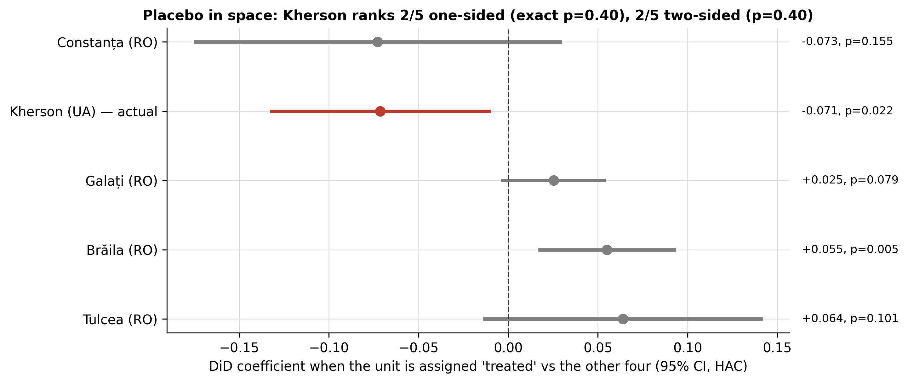

# Can Satellite Vegetation Data Attribute War-Time Environmental Damage to a Single Event? A Difference-in-Differences Test of the Kakhovka Dam Destruction

## Abstract

Satellite imagery is increasingly proposed as evidence of conflict-related environmental harm, yet most assessments describe change rather than test whether it exceeds background variation. This study tests whether vegetation greenness in Kherson Oblast, Ukraine, declined after the destruction of the Kakhovka Dam on 6 June 2023 by more than in four Romanian counties outside the war. Monthly Sentinel-2 NDVI composites (January 2022–November 2024), with clouds and water masked, were analysed with a Difference-in-Differences design on the monthly treated-minus-control gap, using Newey–West standard errors. Kherson's NDVI declined relative to its primary control by 0.108 (95% CI 0.007 to 0.209; p = 0.037) and by 0.069 after allowing zone-specific seasonality (p = 0.005); the decline was largest in the second post-event growing season, and a placebo date showed no effect. Attribution to the dam nevertheless remains unsupported: in an exact randomization test Kherson ranked second of five units (p = 0.40), four of five pre-event quarters already deviated, and the oblast-scale unit mixes flooding, reservoir drainage and war effects. The case shows that a statistically significant satellite signal and an event-attributable one are different claims.

**Keywords**: ecocide, remote sensing, Difference-in-Differences, NDVI, randomization inference, armed conflict, Kakhovka Dam

---

## 1. Introduction

On 6 June 2023 the Kakhovka Dam on the Dnipro River was destroyed. The reservoir behind it, about 18.2 km³ at full capacity (Vyshnevskyi et al., 2023), drained within days, and the downstream floodplain between the dam and the Dnipro–Buh estuary was inundated. The event is among the largest environmental disasters of the war in Ukraine (Shumilova et al., 2025), and it is frequently cited in debates about recognising "ecocide" as an international crime.

Any claim that a specific act caused specific environmental damage faces a basic evidential problem: the affected region was changing anyway. Kherson Oblast had been an active war zone since February 2022, and vegetation varies strongly with season and weather. A comparison of "before" and "after" imagery cannot separate the effect of one dated event from these background changes. Causal-inference designs developed for policy evaluation address this problem by comparing the affected unit with unaffected units over the same period.

This paper asks whether such a design can do that job here. It applies a Difference-in-Differences (DiD) design to monthly Sentinel-2 NDVI, comparing Kherson Oblast with four Romanian counties, and subjects the estimate to placebo tests, an event study, randomization inference and a check for independent movement among the controls. The answer has two parts. Kherson's vegetation did decline relative to its controls after June 2023, by an amount that is statistically significant, robust to seasonality and absent at a placebo date. But the checks that ask whether this decline is specific to Kherson and to June 2023 do not support attributing it to the dam. The paper also reports how the result changed across three versions of the analysis, because the sensitivity of satellite-derived evidence to technical choices is itself relevant to its use in accountability processes.

## 2. Background

### 2.1 Ecocide in international and domestic law

Environmental damage in armed conflict is already addressed in international criminal law, most directly by Article 8(2)(b)(iv) of the Rome Statute, which criminalises "intentionally launching an attack in the knowledge that such attack will cause … widespread, long-term and severe damage to the natural environment which would be clearly excessive in relation to the concrete and direct overall military advantage anticipated" (Rome Statute, 1998). A standalone crime of ecocide does not yet exist in the Statute. In September 2024 Vanuatu, Fiji and Samoa formally proposed an amendment adding one, based on the definition drafted by an independent expert panel convened by the Stop Ecocide Foundation in 2021 (Stop Ecocide International, 2024). Several states have domestic provisions: Ukraine's Criminal Code includes an ecocide offence (Article 441), and Belgium adopted one in its 2024 criminal-code reform (Atılgan Pazvantoğlu, 2025). How far such a crime could apply in wartime remains contested (Killean, 2025). Whatever form the law takes, prosecutions will need evidence that links environmental change to a specific act.

### 2.2 Satellite imagery as evidence

Satellite imagery has supported international criminal proceedings for more than a decade, including the International Criminal Court's case on the destruction of cultural heritage in Timbuktu (*Prosecutor v. Al Mahdi*, 2016). It has mostly served to corroborate witness testimony rather than as stand-alone proof, and commentators have repeatedly pointed to the lack of agreed forensic standards for interpreting it (Kroker, 2015; Wang et al., 2013). The recurring weakness is the reliability of the analysis rather than of the imagery: interpretation is largely expert and qualitative, and rarely states how likely the observed change would be without the alleged act.

### 2.3 Existing assessments of the Kakhovka event

The consequences of the dam's destruction have been documented with field data, remote sensing and modelling, including reservoir drainage, downstream flooding, contamination of the exposed reservoir bed and effects on estuarine and marine systems (Shumilova et al., 2025; Vyshnevskyi et al., 2023). A recent geospatial assessment of war-related ecosystem destruction in Ukraine, which includes the lower Dnipro, combines multi-temporal imagery with qualitative synthesis and explicitly does not attribute observed changes causally (Leal Filho et al., 2026). UNOSAT mapped the flood extent from several sensors within days of the event (UNITAR/UNOSAT, 2023). To the author's knowledge, none of these studies estimates the event's effect on vegetation against unaffected control regions with a counterfactual design; that is the gap this paper addresses.

### 2.4 Environment and security

Armed conflict degrades environmental performance for years after fighting ends (Krampe et al., 2025), and the destruction of water infrastructure affects food and water security well beyond the flooded area. Quantitative, event-specific evidence is relevant to recovery planning as well as to accountability, provided its uncertainty is stated honestly.

## 3. Data and Methods

### 3.1 Study design and zones

The treated unit is Kherson Oblast, Ukraine (GADM v4.1 polygon, ≈25,500 km²). The primary control is Tulcea County, Romania, which contains most of the Danube Delta; the four-county panel adds Galați, Brăila and Constanța counties (Figure 1). The controls were chosen by the author for broadly similar delta, steppe and coastal landscapes and a continental climate outside the war zone; no formal matching was performed. Within-Ukraine controls were rejected because war effects reach far beyond the front line, and the Ukrainian part of the Danube Delta (Odesa Oblast) because its Danube ports were attacked during the study period. Tulcea County nevertheless borders Odesa Oblast.

Two features of the treated unit matter for interpretation. First, the mapped flood covered at most about 564 km² of the oblast (Section 4.1), roughly 2% of its area. Second, the southern part of the former reservoir lies inside the oblast: the pre-breach water extent upstream of the dam inside the polygon is about 556 km² (UNOSAT water-extent layer, 3–5 June 2023). Water pixels are masked in the NDVI extraction (Section 3.3), so the drained bed enters the series as it becomes land. The NDVI outcome therefore averages downstream flooding, vegetation change on the former reservoir bed, any loss of reservoir-fed irrigation, and war effects unrelated to the dam.

*Figure 1. Treatment zone and the four Romanian control counties (GADM v4.1). Star: Kakhovka Dam.*

### 3.2 Data

| Variable | Source |
|---|---|
| NDVI, monthly | Sentinel-2 L2A via the Sentinel Hub Statistical API (Copernicus Data Space Ecosystem) |
| Flood extent | UNITAR/UNOSAT (2023), product FL20230606UKR: Sentinel-1, Sentinel-2, Sentinel-3 and ICEYE layers |
| True-colour imagery | Sentinel-2 L2A via the Sentinel Hub Process API (context only) |
| Boundaries | GADM v4.1 (GADM, 2022) |

### 3.3 NDVI extraction

For each zone and month from January 2022 to November 2024 (35 months), NDVI = (B08 − B04)/(B08 + B04) was computed for every Sentinel-2 L2A acquisition over the zone's GADM polygon on a common 0.002° grid (≈150 m × 220 m at these latitudes, identical for all zones). Pixels classified by the Sentinel-2 Scene Classification (SCL) as no data, saturated, cloud shadow, water, medium- or high-probability cloud, thin cirrus or snow were masked; scenes with more than 80% cloud cover were skipped. For each pixel, the median NDVI of all valid acquisitions in the month was taken, and these values were averaged over the polygon. The share of grid cells with at least one valid acquisition ranged from 25% to 49% for Kherson, whose polygon occupies about half of its bounding box.

This is the third version of the extraction. The first, used in a preprint of this study, queried each zone's bounding box with scene-level cloud filtering only. The second queried the polygon with pixel-level cloud masking but left the pixel size unspecified, so the API sampled each zone on a 256 × 256 grid (≈880 m over Kherson, ≈335 m over Brăila), kept water pixels, and used a single scene per pixel per month. The results under each version are reported in the code repository; Section 5 discusses how they differ.

### 3.4 Estimation

For each comparison, the monthly gap between the treated zone and the mean of its control zone(s) was formed, gₜ = NDVIₜ(treated) − NDVIₜ(controls), and the DiD effect was estimated as

gₜ = α + β·Postₜ + εₜ,

where Postₜ = 1 from June 2023. For balanced data β is identical to the interaction coefficient of the conventional two-way model NDVIᵢₜ = γ·Treatedᵢ + δ·Postₜ + β·(Treatedᵢ × Postₜ) + month effects + εᵢₜ. Estimating it on the gap series matters for inference. With one treated unit, cluster-robust standard errors are unusable, and with five units they are unreliable (Cameron & Miller, 2015). The alternative, Newey–West heteroskedasticity- and autocorrelation-consistent (HAC) standard errors (Newey & West, 1987), requires the observations to be ordered in time. On the gap series they are: the lag window covers consecutive calendar months. In a stacked two-zone table, used in the earlier versions of this study, the window runs across the join between zones and treats same-month observations of the two zones as independent. All results use HAC standard errors with three lags and the t distribution; classical OLS results are shown for comparison.

The primary specification includes no month-of-year terms, because month effects shared by both zones cancel in the gap. A second specification adds month-of-year dummies to the gap regression, allowing each zone its own seasonal cycle. This matters because the pre-period (January 2022–May 2023) contains two January–May seasons and one June–December season, while the post-period contains two June–November seasons; if the zones' seasonal amplitudes differ, shared month effects leave a seasonal difference that loads onto Post.

### 3.5 Validation checks

- *Placebo in time*: a fake event date of June 2022, using pre-event data only.
- *Narrowed baseline*: the model restricted to January 2023 onward, with its own placebo (fake date March 2023 within January–May 2023, one HAC lag).
- *Event study*: the gap regressed on quarter dummies relative to June 2023 (quarter 0 = June–August 2023), with March–May 2023 as reference; eleven coefficients, corrected with the Bonferroni and Benjamini–Hochberg (1995) procedures.
- *Four-county panel*: Kherson against the mean of all four controls and against each separately.
- *Placebo in space*: each of the five units assigned "treated" status in turn against the other four; Kherson's rank gives an exact randomization p-value (Conley & Taber, 2011), whose minimum with five units is 0.20.
- *Control-only divergence*: each Romanian county treated against the other three, with Kherson excluded.
- *Specification checks*: HAC lag lengths of one to six months, log(NDVI), and exclusion of zone-months with less than 15% or 25% valid coverage.

All estimates are produced by a single script and stored in one results file (see Data and Code Availability).

### 3.6 Pre-event comparability

Over the pre-event period, mean NDVI was 0.376 in Kherson (SD 0.076, n = 17 months) and 0.404 in Tulcea (SD 0.120); the difference is not significant (Welch t-test, p = 0.43). Seasonal amplitude, the range of the monthly means, was 0.202 in Kherson and 0.333 in Tulcea. Similar levels with different seasonal amplitudes are the situation in which shared month effects are insufficient (Section 3.4).

## 4. Results

### 4.1 Flood extent

UNOSAT's layers map the downstream flood on six dates with four sensors (Table 1; Figures 2 and 3). The largest single-sensor extent is ICEYE radar on 7 June, 520.8 km² within a 2,098 km² analysis area; Sentinel-3 maps 122.5 km² on 6 June and 464.2 km² on 9 June at coarser resolution; UNOSAT's cumulative 6–9 June composite is 617 km², of which 564 km² lies inside Kherson Oblast. By 21 June, Sentinel-1 radar maps 21.2 km². The layers differ in sensor, resolution, analysis extent and cloud obstruction, so they document the flood's rise and recession qualitatively rather than as a continuous series; UNOSAT describes them as preliminary and not yet validated in the field.

*Table 1. UNOSAT flood-extent layers (areas computed in an equal-area projection).*

| Date (2023) | Sensor | Flood extent (km²) | Inside Kherson Oblast (km²) | Analysis extent (km²) |
|---|---|---|---|---|
| 6 June | Sentinel-3 | 122.5 | 122.5 | 18,751 |
| 7 June | ICEYE | 520.8 | 494.7 | 2,098 |
| 8 June | Sentinel-2 | 260.9 | 220.1 | 18,751 |
| 9 June | Sentinel-3 | 464.2 | 439.3 | 18,751 |
| 13 June | Sentinel-2 | 179.9 | 164.8 | 11,031 (55% cloud-obscured) |
| 21 June | Sentinel-1 | 21.2 | 16.0 | 10,788 |
| 6–9 June composite | multiple | 617.0 | 564.0 | — |

*Figure 2. UNOSAT flood-extent layers for 6, 9 and 21 June 2023.*

*Figure 3. Flood extent in each UNOSAT layer, by sensor. Points are separate observations.*

Sentinel-2 true-colour mosaics of the lower Dnipro before (April–May 2023) and after (July 2023) the breach are provided with the code as geographic context. The frame covers the downstream floodplain and only the south-western tip of the former reservoir.

### 4.2 NDVI and the primary estimate

Monthly NDVI in Kherson and Tulcea is similar in spring but diverges in summer and autumn, when Tulcea stays greener (Figure 4). The divergence widens after June 2023 and is largest in the 2024 growing season, when Kherson's June–November NDVI stayed between about 0.26 and 0.34 while Tulcea's stayed above 0.45. The primary DiD estimate is −0.108 NDVI (95% CI −0.209 to −0.007; HAC p = 0.037; classical p = 0.001), equal to 29% of Kherson's pre-event mean NDVI — a scale reference, not a measured loss of vegetation.

*Figure 4. Monthly mean NDVI, Kherson Oblast and Tulcea County (cloud- and water-masked monthly median composites).*

### 4.3 Seasonality

Allowing each zone its own seasonal cycle reduces the estimate to −0.069 (95% CI −0.116 to −0.023; p = 0.005). About a third of the primary estimate is therefore attributable to the different seasonal amplitudes of the two zones combined with the different seasonal composition of the pre- and post-event windows; the remainder is not.

### 4.4 Placebo tests and the narrowed baseline

The placebo with a fake event date of June 2022 returns +0.012 (95% CI −0.086 to 0.109; p = 0.802): no comparable shift appears a year earlier. Restricting the window to January 2023 onward gives a larger estimate, −0.186 (95% CI −0.280 to −0.092; p = 0.001), but that window's own placebo, a fake date of March 2023 within January–May 2023, is also significant (−0.103; p = 0.004). With five months the placebo is fragile, but it means the narrowed estimate cannot be read as a cleaner measure of the event (Figure 5).

*Figure 5. Primary and narrowed-baseline estimates with their placebo tests; classical and HAC 95% confidence intervals.*

### 4.5 Event study

After the event, the gap is significantly more negative than in the reference quarter in five of six quarters (Figure 6): June–August 2023 (−0.137), September–November 2023 (−0.156), March–May 2024 (−0.078, p = 0.011), June–August 2024 (−0.245) and September–November 2024 (−0.236); all but March–May 2024 have p < 0.001 and survive Bonferroni correction (threshold p < 0.0045). Only December 2023–February 2024 is close to zero (−0.017, p = 0.15).

Before the event, four of five quarters also differ significantly from the reference quarter: January–February 2022 (−0.038, p = 0.018), March–May 2022 (−0.050, p = 0.001), June–August 2022 (−0.159, p < 0.001) and December 2022–February 2023 (+0.080, p < 0.001). Part of the post-event pattern is therefore seasonal: June–August is strongly negative in 2022 as well. The comparison that the seasonal pattern cannot explain is between the same seasons in different years: the summer–autumn gap was −0.159 and −0.054 in 2022, −0.137 and −0.156 in 2023, and −0.245 and −0.236 in 2024. The decline grows in the second post-event season rather than appearing as a single step in June 2023. The pre-event deviations nonetheless violate the parallel-trends assumption on which the DiD estimate rests; the pre-existing conflict in Kherson may explain them, but it does not remove the violation.

*Figure 6. Quarterly event study of the Kherson–Tulcea NDVI gap; 95% HAC confidence intervals; † survives Bonferroni correction.*

### 4.6 Four-county panel

Against the mean of all four Romanian counties the estimate is −0.071 (95% CI −0.132 to −0.011; p = 0.022), and −0.060 with zone-specific seasonality (p = 0.004); the June 2022 placebo is +0.031 (p = 0.223). Against individual controls the estimate is −0.108 for Tulcea (p = 0.037), −0.077 for Galați (p = 0.007), −0.101 for Brăila (p = 0.003) and +0.001 for Constanța (p = 0.98) (Figure 7). Three of four comparisons agree in sign and significance; Constanța, the most coastal and urbanised control, shows no difference.

*Figure 7. Kherson against each control county and the four-county mean; 95% HAC confidence intervals.*

### 4.7 Placebo in space

When each of the five units is treated in turn against the other four at the real June 2023 date, Kherson's estimate (−0.071) is almost exactly matched by Constanța's (−0.073), and it is the second largest in absolute value, after Constanța (Figure 8). The exact randomization p-value is 0.40, one-sided and two-sided. By this test, a post-June-2023 decline of Kherson's size relative to the other units is not unusual among these five units.

*Figure 8. Placebo in space: each unit assigned "treated" status against the other four.*

### 4.8 Control-only divergence

Excluding Kherson and treating each Romanian county against the other three, Constanța shows a borderline decline of its own (−0.097, p = 0.084) and Brăila a small significant rise (+0.040, p = 0.045); Tulcea (+0.049, p = 0.18) and Galați (+0.008, p = 0.63) show no significant shift. The control counties are therefore not uniformly stable over the study window, and Constanța in particular moves in the same direction as Kherson. This check does not show why; regional spillover, changes in Black Sea shipping and grain markets, weather and local land use are all possible.

### 4.9 Specification checks

Across HAC lag lengths of one to six months, the p-value of the primary estimate ranges from 0.010 to 0.042. In logs, the estimate is −0.291 log points, about −25% (p = 0.030). Excluding zone-months with less than 15% or 25% valid coverage (February 2023 in Galați and Brăila) leaves the primary estimate unchanged, as neither month belongs to its zones, and moves the pooled estimate to −0.069 (p = 0.023).

## 5. Discussion

The dam's destruction is not in doubt, nor is the flooding it caused (Section 4.1). What this study tests is whether monthly NDVI over Kherson Oblast changed after June 2023 in a way that a counterfactual design can attribute to the event. The results separate two claims that are easily conflated. The first — that Kherson's vegetation declined relative to comparable unaffected regions after June 2023 — is supported: the decline is statistically significant against the primary control and the pooled panel, survives zone-specific seasonality, lag-length and functional-form choices, and is absent at a placebo date a year earlier. The second — that the decline is specific to the dam's destruction — is not established. With five units, Kherson's movement is matched by Constanța's, so randomization inference gives p = 0.40; the parallel-trends assumption is violated before the event; and the decline builds up over the second growing season instead of appearing as a step in June 2023.

The timing and scale of the decline are informative about mechanism, though this design cannot test mechanisms. The mapped flood covered about 2% of the oblast; even total loss of vegetation on every flooded pixel would move the oblast mean by roughly 0.02, far less than the estimated decline. A decline that deepens in the 2024 season and spans the whole oblast is more consistent with slower, larger-scale pathways — the loss of reservoir-fed irrigation water for southern Kherson's farmland, or the war's continuing effects on agriculture — than with the flood itself. Distinguishing these pathways requires treated units that match the footprint of each one, which an oblast-wide mean cannot provide.

The history of this analysis carries a further lesson. The first version (bounding-box extraction, stacked-panel standard errors) reported a significant decline of −0.070 (p = 0.022). Correcting the extraction geometry and the standard errors reduced the estimate to −0.075 with p = 0.16. Correcting the pixel size, masking water and compositing each month over all clear acquisitions then produced the estimate reported here, −0.108 with p = 0.037. Each change was technical, and each moved the headline conclusion across the conventional significance threshold. Satellite-derived evidence intended for accountability processes should therefore be released with the code that produces it and with the falsification checks used here, so that results can be reproduced and challenged.

For the legal framing in Section 2.1, the implication is limited but concrete. The flood record documents the extent of inundation, and the NDVI analysis documents a statistically detectable relative decline in vegetation across the oblast that persisted for at least eighteen months, which bears on the "widespread", "severe" and "long-term" elements of Article 8(2)(b)(iv) only as descriptive evidence. It does not establish that the decline was caused by the dam's destruction rather than by other war-related or regional factors, and nothing in this study bears on intent, proportionality or responsibility.

## 6. Limitations

- **Unit of analysis.** The treated unit is the whole oblast, which mixes flooding, the former reservoir bed, possible irrigation loss and war effects unrelated to the dam (Section 3.1).
- **Few units and hand-picked controls.** Five units limit randomization inference to p ≥ 0.20; the controls were not formally matched, and Constanța moves in the same direction as Kherson.
- **Parallel trends.** Four of five pre-event quarters deviate significantly from the reference quarter.
- **Valid coverage.** Monthly composites rest on 25–49% of Kherson's grid cells; the rest is cloud, water or outside the polygon.
- **Temporal resolution.** The June 2023 value pools five pre-event days with 25 post-event days.
- **Single indicator.** NDVI measures greenness only, not soil contamination, salinity, water quality or biodiversity.
- **Flood data.** UNOSAT layers are preliminary, come from different sensors and analysis extents, and are used descriptively.

## 7. Conclusion

After the destruction of the Kakhovka Dam, monthly Sentinel-2 NDVI over Kherson Oblast declined relative to Romanian control counties by an amount that is statistically significant (primary estimate −0.108, 95% CI −0.209 to −0.007; −0.069 after allowing zone-specific seasonality), largest in the second post-event growing season and absent at a placebo date. The design does not, however, attribute that decline to the dam: one control county shows an equally large shift, pre-event quarters already deviate, and the oblast-wide unit mixes several mechanisms. A statistically significant satellite signal and an event-attributable one are different claims, and studies offered as evidence of conflict-related environmental damage should report the tests that distinguish them.

## Data and Code Availability

All code, derived data and figures are available in a public repository [link removed for anonymous review]. `generate_model_results.py` reproduces every estimate in this paper from the NDVI files in `data/ndvi_v3` and writes them to `outputs/model_results.json`; `download_ndvi_polygon_v3.py` re-extracts those files from Sentinel Hub; `flood_progression.py` reproduces Table 1 from the UNOSAT layers. Sentinel-2 data are available from the Copernicus Data Space Ecosystem, UNOSAT layers from UNITAR/UNOSAT, and boundaries from GADM. An earlier version of this work with superseded results was posted as a preprint (details supplied to the editorial office).

## References

Atılgan Pazvantoğlu, C. (2025). Ecocide as a separate crime under the Rome Statute: A legal analysis of the discourse. *Environmental Policy and Law*, 55(2–3), 57–67. https://doi.org/10.1177/18785395251351171

Benjamini, Y., & Hochberg, Y. (1995). Controlling the false discovery rate: A practical and powerful approach to multiple testing. *Journal of the Royal Statistical Society: Series B (Methodological)*, 57(1), 289–300. https://doi.org/10.1111/j.2517-6161.1995.tb02031.x

Cameron, A. C., & Miller, D. L. (2015). A practitioner's guide to cluster-robust inference. *Journal of Human Resources*, 50(2), 317–372. https://doi.org/10.3368/jhr.50.2.317

Conley, T. G., & Taber, C. R. (2011). Inference with "difference in differences" with a small number of policy changes. *The Review of Economics and Statistics*, 93(1), 113–125. https://doi.org/10.1162/REST_a_00049

GADM. (2022). *GADM database of global administrative areas, version 4.1*. https://gadm.org

Killean, R. (2025). Ecocide's evolving relationship with war. *Environment and Security*. Advance online publication. https://doi.org/10.1177/27538796251347111

Krampe, F., Kreutz, J., & Ide, T. (2025). Armed conflict causes long-lasting environmental harms. *Environment and Security*, 4(1). https://doi.org/10.1177/27538796251323739

Kroker, P. (2015, April 23). Satellite imagery as evidence for international crimes. *International Justice Monitor*. https://www.ijmonitor.org/2015/04/satellite-imagery-as-evidence-for-international-crimes/

Leal Filho, W., Fedoruk, M., Kunyk, O., Semak, U., Yaroshenko, N., Ruda, M., Eustachio, J. H. P. P., Dinis, M. A. P., & Luetz, J. M. (2026). Ecocide in Ukraine: An assessment of geospatial and environmental evidence of war-related ecosystem destruction in Ukraine. *Frontiers in Environmental Science*. https://doi.org/10.3389/fenvs.2026.1823887

Newey, W. K., & West, K. D. (1987). A simple, positive semi-definite, heteroskedasticity and autocorrelation consistent covariance matrix. *Econometrica*, 55(3), 703–708. https://doi.org/10.2307/1913610

*Prosecutor v. Ahmad Al Faqi Al Mahdi*, ICC-01/12-01/15, Judgment and Sentence (International Criminal Court, Trial Chamber VIII, 27 September 2016).

Rome Statute of the International Criminal Court, July 17, 1998, 2187 U.N.T.S. 90.

Shumilova, O., Sukhodolov, A., Osadcha, N., Oreshchenko, A., Constantinescu, G., Afanasyev, S., Koken, M., Osadchyi, V., Rhoads, B., Tockner, K., Monaghan, M. T., Schröder, B., Nabyvanets, J., Wolter, C., Lietytska, O., van de Koppel, J., Magas, N., Jähnig, S. C., Lakisova, V., … Grossart, H. P. (2025). Environmental effects of the Kakhovka Dam destruction by warfare in Ukraine. *Science*, 387(6739), 1181–1186. https://doi.org/10.1126/science.adn8655

Stop Ecocide International. (2024, September 9). *Mass destruction of nature reaches International Criminal Court (ICC) as Pacific island states propose recognition of "ecocide" as international crime*. https://www.stopecocide.earth/2024/mass-destruction-of-nature-reaches-international-criminal-court-icc-as-pacific-island-states-propose-recognition-of-ecocide-as-international-crime

UNITAR/UNOSAT. (2023). *Flood extent analysis following the destruction of the Nova Kakhovka dam, Khersonska Oblast, Ukraine (event code FL20230606UKR)* [Data set]. United Nations Institute for Training and Research. https://unosat.org

Vyshnevskyi, V., Shevchuk, S., Komorin, V., et al. (2023). The destruction of the Kakhovka dam and its consequences. *Water International*, 48(5). https://doi.org/10.1080/02508060.2023.2247679

Wang, B. Y., Raymond, N., Gould, G., & Baker, I. (2013). Problems from hell, solution in the heavens? Identifying obstacles and opportunities for employing geospatial technologies to document and mitigate mass atrocities. *Stability: International Journal of Security and Development*, 2(3), Article 53. https://doi.org/10.5334/sta.cn
